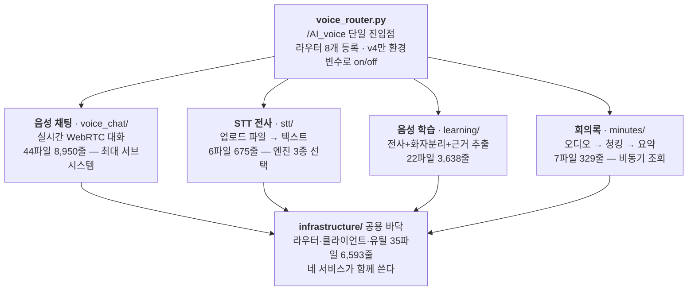

---
tags:
  - 아사달
  - 프로젝트
  - AI음성
  - 아키텍처
created: 2026-08-20
updated: 2026-08-20
---

# AI음성 - 폴더·파일 역할 지도

> [!summary] 한 줄 요약
> `ai_voice` 패키지 **전체**를 "이 폴더·파일이 무엇을 담당하는가" 기준으로 정리했다. 149개 파일 26,000여 줄이 네 개의 성격이 다른 서비스 + 공용 바닥으로 나뉜다. v4 심층은 [[AI음성 - 파일·함수 레퍼런스]], 실행 흐름의 의미는 [[AI음성 - 런타임 플로우]] 참고.

## 한눈에 — "음성"이라는 이름의 네 서비스

`ai_voice` 는 단일 기능이 아니다. **오디오를 다룬다는 공통점만 있는 네 개의 독립 서비스**가 한 패키지에 들어 있고, 그 밑에 공용 바닥이 깔려 있다.



규모가 말해주는 것이 있다. **음성 채팅이 전체의 3분의 1**이고, 회의록은 329줄뿐이다. 회의록이 작은 이유는 실제 일(전사·요약)을 자기가 하지 않고 공용 모듈에 위임하기 때문이다 — 워크플로우 배선만 갖고 있다.

## 최상위 구조

| 경로 | 파일·줄 | 담당 |
|---|---|---|
| `voice_router.py` | 82줄 | 라우터 8개를 `/AI_voice` 아래 묶는 유일한 진입점 |
| `constants.py` | 1줄 표기지만 실체 200여 줄 | 모델 ID, GA/Legacy 세션 config, 오디오 상수. **하드코딩을 여기로 몰아둔 곳** |
| `infrastructure/` | 35파일 6,593줄 | 공용 바닥 — 라우터·외부 클라이언트·유틸 |
| `services/` | 81파일 13,875줄 | 네 개 도메인 서비스의 실제 로직 |
| `voice_tests/` | 24파일 5,163줄 | 테스트 179건. v4 회귀가 대부분 |
| `terms/` | JSON 1개 | `voice_learning_terms.ko.json` — 음성 학습 용어 사전 |
| `tools/` | 72줄 | `llm_usage_probe.py` — LLM 토큰 사용량 측정 도구 |

## 1 · 진입점 — `voice_router.py`

이 파일 하나가 **8개 라우터를 `/AI_voice` 접두사 아래 등록**한다. 앱(`app.py`)은 이 라우터 하나만 알면 된다.

특징적인 방어가 둘 있다.

```
v4 라우터만 try/except import
  → aiortc 미설치 환경에서 v4 import 가 실패해도 앱 전체가 죽지 않는다

ENABLE_VOICE_V4 환경변수
  → 코드 배포 없이 v4 를 끄는 비상 스위치. 2026-07-13 롤백 이력 때문에 남겼다
  → 알 수 없는 값이면 기본값(on) 유지 — 오타로 조용히 꺼지지 않게
```

`_VoiceChatAccessLogFilter` 도 여기 있다. 초당 수십 건 찍히는 `/client-stats`·`/updates` 접근 로그를 uvicorn 로거 단에서 걸러 운영 로그 가독성을 지킨다.

## 2 · `infrastructure/` — 네 서비스가 함께 쓰는 바닥

이름대로 **기술적 관심사**(어떻게)를 담고, 도메인 로직(무엇을)은 `services/` 가 갖는다.

### `api/router/` — 진입점 8개

| 라우터 | 접두사 | 담당 |
|---|---|---|
| `stt_router.py` (558줄) | (없음) | `/upload-audio` 파일 전사, `/analyze-audio-db`, 풀 상태·언어 목록 조회, WebRTC 프록시 계열 |
| `learning_router.py` (559줄) | (없음) | `/voice-learning/transcribe-and-summarize[-metrics]` — 음성 학습 2종 |
| `minutes_router.py` (290줄) | (없음) | `/minutes_summarize` 제출 → `/minutes_summarize_result/{task_id}` 조회 |
| `voice_chat_v1_router.py` | (없음) | 음성 채팅 1세대 |
| `voice_chat_v2_router.py` (373줄) | `/voice-chat` | 2세대 — RAG 결합 |
| `voice_chat_v3_router.py` (340줄) | `/voice-chat-v3` | 3세대 — 브릿지리스 P2P. **현재 운영 주력 중 하나** |
| `voice_chat_v4_router.py` (383줄) | `/voice-chat-v4` | 4세대 — Server-In-Path. 게이트 트랙 주입, 필터 7필드 세션별 주입 |
| `ice_diag_router.py` (398줄) | `/diag/ice` | ICE/NAT 진단 **임시** 라우터. `ENABLE_ICE_DIAG=on` 일 때만 응답, v4 모바일 검증 후 제거 예정 |

라우터가 v1~v4까지 네 세대가 살아 있는 것이 이 패키지의 가장 큰 특징이다. 세대를 지우지 않고 쌓아온 이유와 각 세대 차이는 [[v3와 v4 아키텍처]] 참고.

### `client/` · `core/`

| 파일 | 줄 | 담당 |
|---|---|---|
| `client/openai_realtime_client.py` | 98 | OpenAI Realtime(WebRTC) 저수준 클라이언트 |
| `core/connection/service_pool.py` | 116 | `VoiceServicePool` — STT·TTS 서비스 인스턴스 풀. 매 요청마다 새로 만들지 않기 위한 것 |
| `core/connection/socket_manager.py` | 144 | WebSocket 연결·세션 풀 매니저 |

### `utils/` — 14개 유틸 (6,000줄 중 절반)

여기가 **네 서비스의 공통 분모**다. 특히 앞의 셋은 STT 품질을 좌우한다.

| 파일 | 줄 | 담당 |
|---|---|---|
| `segment_enricher.py` | 799 | 전사 세그먼트에 화자 역할·이름을 붙이는 최대 유틸. 사회자·발표자 등 역할 예외 사전 포함 |
| `audio_normalizer.py` | 633 | librosa 기반 오디오 정규화. **작은 소리는 증폭, 큰 소리는 압축**해 STT 인식률을 올린다 |
| `learning_transcription_utils.py` | 385 | 음성 학습 전사 결과 가공 공통 함수 |
| `chunk_utils.py` | 229 | 긴 전사를 청크로 자른다. Whisper word-level 타임스탬프 → 시간 기반 청크 |
| `ai_voice_llm.py` | 160 | LLM 클라이언트 팩토리 (환경에 따라 Kimi 등 대체 모델 지원) |
| `word_entry_parser.py` | 136 | 텍스트 속 `{...}` JSON 객체를 감지해 줄 단위로 정리하는 CLI |
| `language_registry.py` | 131 | 언어 코드 레지스트리 |
| `voice_isolator.py` | 128 | ElevenLabs 음성 분리(배경음 제거) 클라이언트 |
| `language_policy.py` | 120 | 언어별 정책(어떤 엔진을 쓸지 등) |
| `llm_metrics.py` | 106 | LLM 호출 토큰·시간 메트릭 타입 |
| `prompt_loader.py` | 77 | YAML 프롬프트 파일 로더 + 메모리 캐시 |
| `logging_utils.py` | 76 | 로거 생성 헬퍼 |
| `language_context.py` | 58 | 요청 단위 언어 컨텍스트 |
| `language_profiles/` | 3파일 | Whisper·ElevenLabs 각각의 지원 언어 목록 |

> [!info] 언어 관련 파일이 4개인 이유
> STT 엔진마다 지원 언어와 코드 표기가 다르다. `language_profiles/` 가 엔진별 원본 목록을, `language_registry` 가 통합 코드를, `language_policy` 가 "이 언어면 어느 엔진" 정책을, `language_context` 가 요청 단위 상태를 맡는 4단 구조다.

## 3 · `services/voice_chat/` — 실시간 음성 대화

44파일 8,950줄로 **패키지 최대 서브시스템**이다. 폴더가 다섯 갈래로 나뉜다.

| 경로 | 담당 |
|---|---|
| `server_webrtc.py` (2,891줄) | **단일 최대 파일.** 세션 매니저 + OpenAI 브릿지. ICE·이벤트 루프·트랙 주입·좀비 정리·세대 가드가 전부 여기 |
| `webrtc_api.py` (235줄) | OpenAI SDP 협상. GA(multipart) / Legacy(application/sdp) 분기 |
| `v3/` (8파일) | 3세대 전용 모듈 — 오디오 트랙, tool orchestrator, RTP 통계 |
| `v4/` (5파일) | 4세대 전용 — 게이트 트랙, orchestrator, 결과 정책, 요약 |
| `rag/` (3파일) | 근거 검색 — 어댑터, 쿼리 보강, 검색 옵션 |
| `workflow/` (13파일) | LangGraph 대화 파이프라인 — 그래프, 노드 7개, 런타임, 스트림 |
| 최상위 정책 파일 4개 | 지시문·세션 스키마·키워드·로깅 |

### v3 와 v4 는 왜 사본이 두 벌인가

같은 이름의 파일이 `v3/` 와 `v4/` 양쪽에 있다 — `audio_tracks.py`, `tool_call_orchestrator.py`, `tool_result_policy.py`, `voice_context_summarizer.py`.

**의도적인 중복이다.** v3 는 운영 중이라 바이트 단위로 고정하고, v4 작업이 v3 를 건드리지 않도록 사본을 떠서 시작했다. 덕분에 `v4/` 안에서는 자유롭게 고칠 수 있지만, 대가로 **양쪽에 같은 버그가 따로 존재**할 수 있다(예: `cancel_tool_tasks` 는 v4에만 있고 v3에는 없다).

다만 **완전 분리는 아니다.** `server_webrtc.py`·`webrtc_api.py`·`realtime_instruction_policy.py` 는 공유하고, v4 의 게이트 트랙은 v3 의 `AudioProxyTrack` 을 **상속**한다(지터버퍼·좀비 가드를 물려받으려고).

> [!danger] `realtime_instruction_policy.py` 는 v3 응답을 바꾼다
> `build_v3_agent_instructions()` 를 v3·v4 라우터가 함께 호출한다. 프롬프트를 고치면 **운영 중인 v3 답변 성향이 즉시 함께 바뀐다.** 8-19 search_web 제거·RAG 재한정, 8-20 "핵심" 표현 제거가 전부 이 공유 반영 사례다(매번 사용자 승인).

### `rag/` — 근거 검색 3파일

| 파일 | 담당 |
|---|---|
| `rag_adapter.py` | `vector_search` — **pgvector** 하이브리드 검색 래퍼. 모듈 경로가 `faiss_process` 라 오해하기 쉽지만 실제 엔진은 pgvector |
| `query_enrichment_service.py` | 후속 질문의 지시 표현("거기 전화번호")에 이전 토픽을 붙인다 |
| `search_options.py` | 검색 옵션 조립 (top_k · chat_bot_id) |

### `workflow/` — LangGraph 대화 파이프라인

| 파일 | 담당 |
|---|---|
| `graph.py` | 그래프 정의 — listener → turn_gate → intent_planner → (조건부) retriever → finalize |
| `nodes/listener.py` | 전사 조각을 문장 단위로 버퍼링 |
| `nodes/turn_gate.py` | 발화 완결 판정 — pass/hold/drop |
| `nodes/intent_planner.py` | RAG 필요 여부 결정 |
| `nodes/retriever.py` | pgvector 검색 실행 |
| `nodes/immediate_rag_response.py` | 즉답 경로 |
| `nodes/initiator.py` · `response_delivery.py` · `script_generator.py` | 선응답·전달·스크립트 생성 |
| `runtime.py` | `VoiceChatGraphRuntime` — 그래프 실행기. `active_session_ids()` 를 좀비 스위퍼가 쓴다 |
| `realtime_speaker.py` (347줄) | `session.update`·`response.create` 송신 전담 |
| `decision.py` (370줄) | RAG 필요 판단 LLM 호출 |
| `streams/streaming_tts_track.py` | 서버 TTS 트랙 (현재 휴면) |

> [!warning] GA 경로에서는 이 워크플로우가 대부분 헛돈다
> 운영 모델 `gpt-realtime-2.1` 은 GA 라 OpenAI 가 발화 종료 즉시 스스로 응답한다. flush 가 GA 가드에 걸려 버퍼만 비우고 끝나므로, LangGraph 는 **Legacy(v2·v4-legacy) 경로에서만 실제 응답을 만든다.** 상세는 [[AI음성 - 런타임 플로우]] 4단계.

## 4 · `services/stt/` — 파일 전사

가장 단순하고 직관적인 서비스다. 업로드된 오디오 파일을 텍스트로 바꾼다.

| 파일 | 줄 | 담당 |
|---|---|---|
| `pipeline.py` | 123 | 공통 파이프라인 — 정규화 → 엔진 호출 → 후처리. **진입점** |
| `whisper_stt.py` | 194 | OpenAI Whisper 엔진 |
| `clova_csr.py` | 169 | 네이버 Clova CSR 엔진 (한국어 특화) |
| `elevenlabs_stt.py` | 134 | ElevenLabs Scribe 엔진 (화자 분리 지원) |
| `utils.py` | 48 | 결과 후처리 |

엔진이 셋인 이유는 언어·용도별 강점이 달라서다. 선택은 `infrastructure/utils/language_policy.py` 가 한다.

## 5 · `services/learning/` — 음성 학습

긴 녹음을 **챗봇 학습 데이터로 만드는** 서비스다. 단순 전사가 아니라 화자를 나누고 역할을 추정하고 근거를 뽑는다.

```
오디오
 → STT + 세그먼트 (stt_and_segments_service.py, 419줄)
 → 후처리 (transcription_postprocess_service.py, 1,186줄 ← 이 서비스의 심장)
 → 요약 + 메트릭 (summarize_and_metrics_service.py, 117줄)
```

`modules/postprocess/` 7파일이 후처리의 실제 알고리즘을 나눠 갖는다.

| 파일 | 줄 | 담당 |
|---|---|---|
| `evidence.py` | 320 | 근거 등급·유형 정규화, 후보 이름 매칭 |
| `evidence_pack.py` | 200 | 근거 묶음 구성 — 발화 윈도우 수집 |
| `chunking.py` | 137 | 세그먼트를 모델 토큰 한계에 맞춰 분할, LLM 메트릭 집계 |
| `speaker_stats.py` | 136 | 화자별 통계 → 역할 추론 → 베이스라인 가설 |
| `roles.py` | 102 | 화자 역할 응답 파싱 |
| `types.py` | 75 | `SpeakerHint`·`SpeakerEvidence`·`SpeakerStats` 등 타입 정의 |
| `parsing.py` | 61 | 프롬프트용 압축 세그먼트 생성, 코드펜스 제거 |

부속으로 `utils/voice_learning_term_dictionary.py`(353줄)가 `terms/voice_learning_terms.ko.json` 을 읽어 전문 용어를 교정하고, `elevenlabs_timestamped.py`(139줄)가 타임스탬프 전사를 담당한다.

## 6 · `services/minutes/` — 회의록

329줄로 가장 작다. **실제 일을 자기가 하지 않기 때문**이다 — STT 는 `services/stt`, 요약은 `services/summarization.py`(287줄)에 위임하고 워크플로우 배선만 갖는다.

```
build_minutes_graph:  stt → chunking → summarize
```

| 파일 | 담당 |
|---|---|
| `workflow/nodes/stt.py` | 공용 STT 파이프라인 호출 |
| `workflow/nodes/chunking.py` | 긴 전사를 청크로 (공용 `chunk_utils` 사용) |
| `workflow/nodes/summarize.py` | 청크별 요약 → 병합 |
| `workflow/runtime.py` · `state.py` · `graph.py` | 실행기·상태·그래프 정의 |

라우터가 **비동기 2단 구조**인 것이 특징이다 — 회의 오디오는 오래 걸리므로 `/minutes_summarize` 가 `task_id` 만 즉시 주고, 클라이언트가 `/minutes_summarize_result/{task_id}` 로 나중에 가져간다.

## 7 · 나머지

| 경로 | 담당 |
|---|---|
| `services/modules/` | `stt.py`·`summarization.py` 각 12줄 — 공용 함수 **re-export 래퍼**. 도메인이 내부 경로를 몰라도 되게 하는 얇은 층 |
| `services/tts/openai_tts_service.py` (264줄) | OpenAI TTS. 기본 음성이 marin (v4 GA 의 cedar 와는 별개 설정) |
| `voice_tests/` (24파일 5,163줄) | 테스트 179건. `conftest.py` 가 무거운 의존성을 빈 패키지로 스텁해 가벼운 venv 에서도 돌게 한다 |
| `terms/voice_learning_terms.ko.json` | 음성 학습 한국어 용어 사전 |
| `tools/llm_usage_probe.py` (72줄) | LLM 토큰 사용량 측정 개발 도구 |

## 무게중심 — 상위 10개 파일

전체 로직의 절반이 이 열 개에 몰려 있다.

| 파일 | 줄 | 속한 서비스 |
|---|---|---|
| `voice_chat/server_webrtc.py` | 2,891 | 음성 채팅 |
| `learning/modules/transcription_postprocess_service.py` | 1,186 | 음성 학습 |
| `infrastructure/utils/segment_enricher.py` | 799 | 공용 |
| `voice_chat/v4/audio_tracks.py` | 685 | 음성 채팅 (v4) |
| `infrastructure/utils/audio_normalizer.py` | 633 | 공용 |
| `router/learning_router.py` | 559 | 음성 학습 |
| `router/stt_router.py` | 558 | STT |
| `voice_chat/v4/tool_call_orchestrator.py` | 526 | 음성 채팅 (v4) |
| `voice_chat/v3/rtp_stats_utils.py` | 423 | 음성 채팅 (v3) |
| `learning/modules/stt_and_segments_service.py` | 419 | 음성 학습 |

## 역인덱스 — "이걸 고치려면 어디를 보나"

| 하고 싶은 일 | 볼 파일 |
|---|---|
| 음성 채팅 소음·끼어들기 조정 | `voice_chat/v4/audio_tracks.py` (게이트 파라미터) |
| 음성 채팅 응답 말투·도구 호출 정책 | `voice_chat/realtime_instruction_policy.py` (**v3 동시 영향**) |
| 응답 음성·모델·VAD 설정 | `ai_voice/constants.py` (GA config) |
| 세션이 안 붙거나 무음 | `voice_chat/server_webrtc.py` + `webrtc_api.py` |
| RAG 결과가 이상함 | `voice_chat/rag/rag_adapter.py` → `chat/faiss_process.pgvector_search` |
| STT 인식률이 낮음 | `infrastructure/utils/audio_normalizer.py`, `services/stt/pipeline.py` |
| 엔진 선택을 바꾸고 싶음 | `infrastructure/utils/language_policy.py` |
| 화자 역할이 잘못 붙음 | `infrastructure/utils/segment_enricher.py`, `learning/modules/postprocess/speaker_stats.py` |
| 회의록 요약 품질 | `services/summarization.py`, `minutes/workflow/nodes/summarize.py` |
| 새 엔드포인트 추가 | `infrastructure/api/router/` + `voice_router.py` 등록 |

## 관련 노트

- [[AI음성]] — 프로젝트 진행 상황
- [[AI음성 - 파일·함수 레퍼런스]] — v4 심층(호출 체인·심볼표·손댈 때 규칙)
- [[AI음성 - 런타임 플로우]] — 통화 하나의 생애 7단계
- [[v3와 v4 아키텍처]] — 세대별 구조 차이
- [[aiortc와 서버측 WebRTC]] — 서버가 피어를 붙드는 방식
