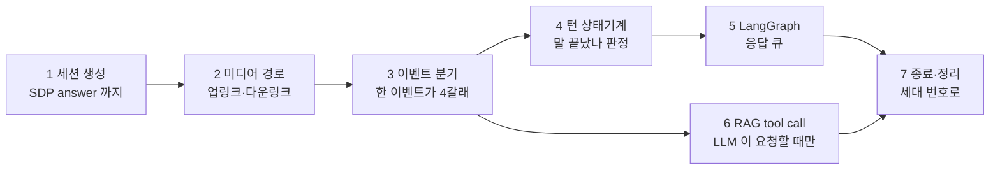
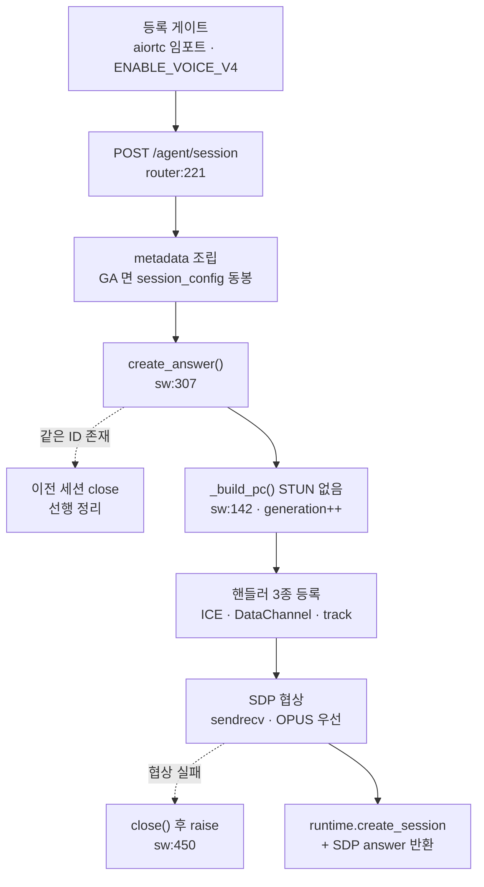
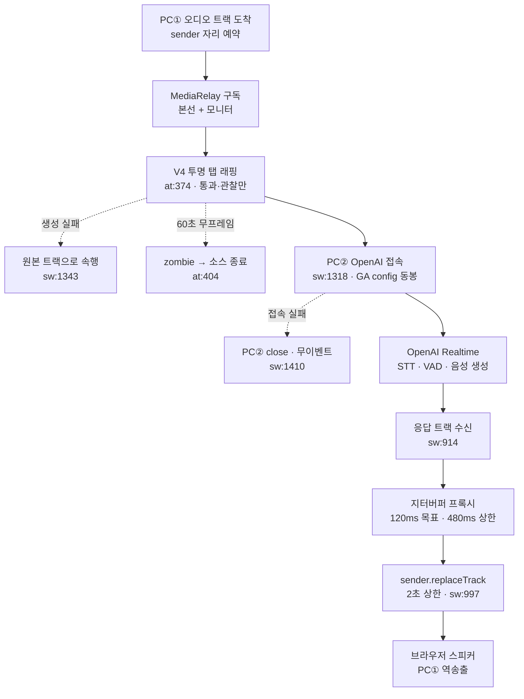
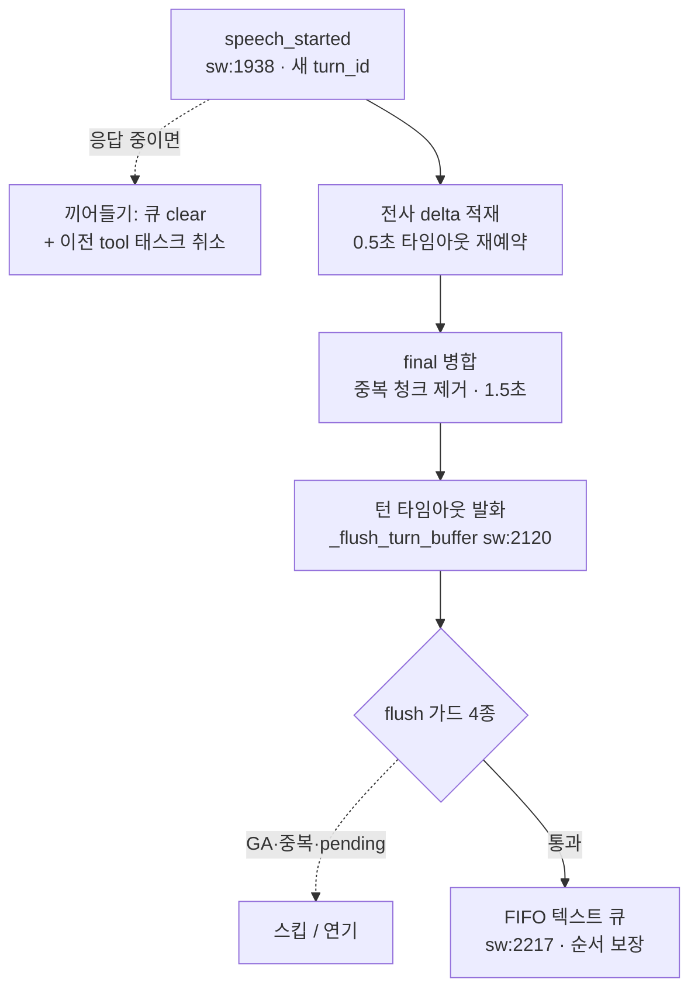
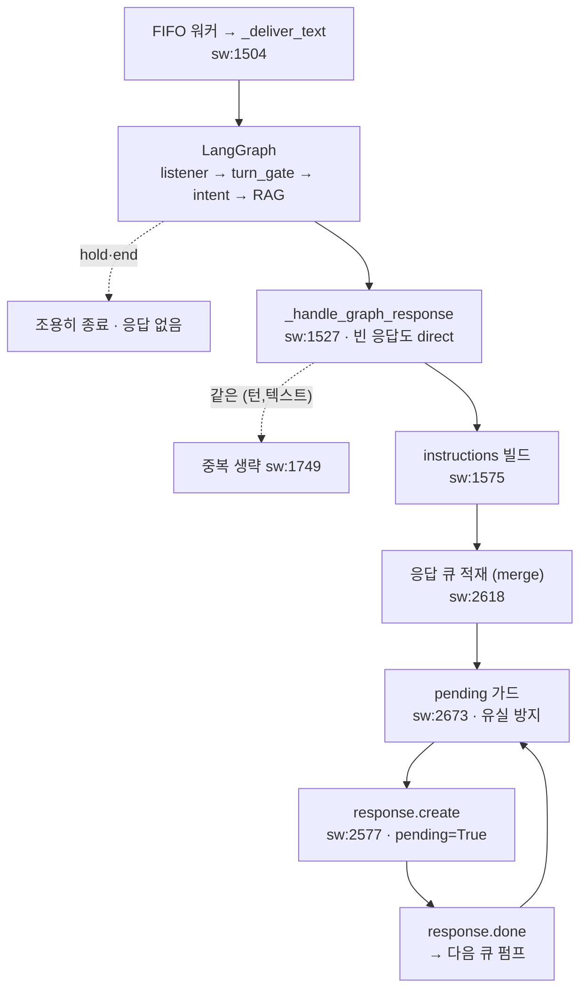
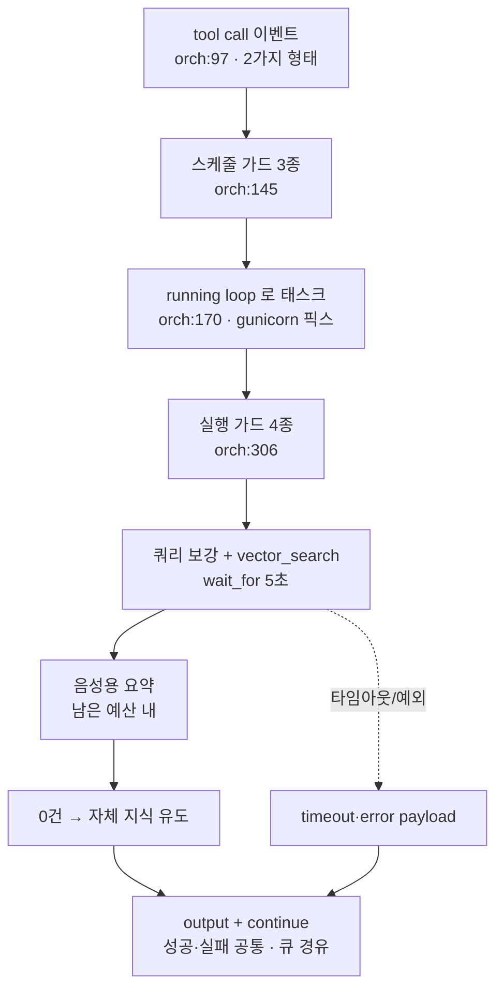
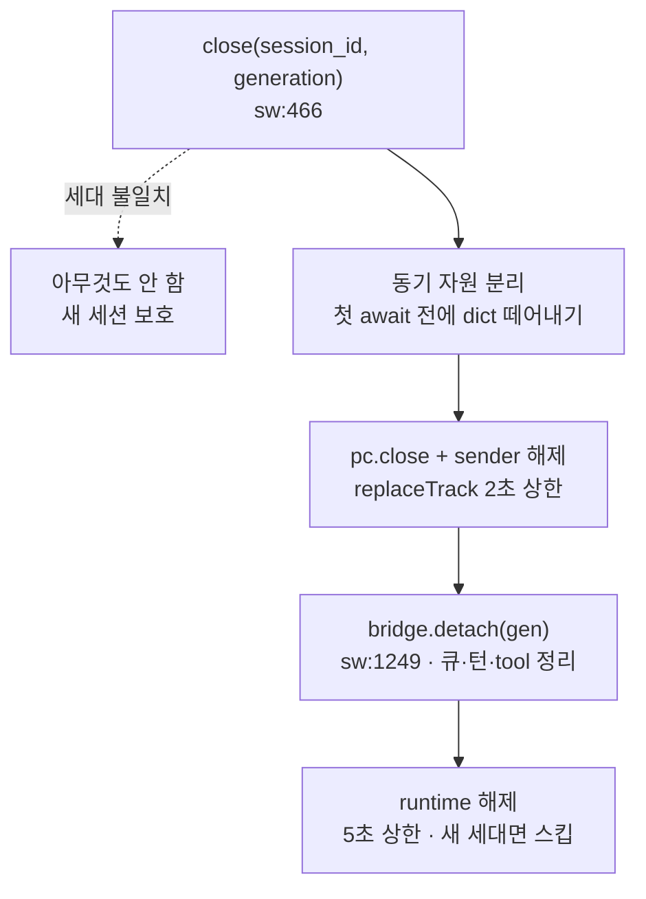

# AI음성 - 런타임 플로우

> [!summary] 한 줄 요약
> v4 통화 하나의 생애 전체를 **7단계**(세션 생성 → 미디어 경로 → 이벤트 분기 → 턴 상태기계 → LangGraph·응답 큐 → RAG tool call → 종료·정리)로, 예외 경로까지 포함해 정리했다. 진행 상황은 [[AI음성]], 어느 파일을 고쳐야 하는지는 [[AI음성 - 파일·함수 레퍼런스]] 참고.

> [!warning] 2026-08-13 전면 갱신
> 8-10 판은 구형 업링크 필터(지터버퍼 + 게이트 3조건 + 패스스루)를 전제로 썼다. 8-11 [[AI음성 - 업링크 투명 탭 재설계|재설계]]로 업링크는 **투명 탭**이 됐고, 8-12 GA 즉답 경로 복원과 8-13 FIFO 재이식이 그 위에 얹혔다. 이 판은 `fix/v4-session-generation-guard-dev` 2026-08-13 코드 실측 기준이다. 위치 표기: `router:` = voice_chat_v4_router.py, `sw:` = server_webrtc.py, `at:` = v4/audio_tracks.py, `orch:` = v4/tool_call_orchestrator.py.

## 전체 구조

브라우저가 통화를 시작하면 세션을 만들고(1), 통화 중에는 오디오(2)와 이벤트 처리(3~6)가 **동시에** 돌고, 끝나면 어느 경로로 죽었든 같은 절차로 정리한다(7).

설계 원칙이 세 개다. **오디오와 RAG 는 병렬**이라 검색이 수 초 걸려도 중계가 멈추지 않는다. **응답은 한 번에 하나**라 모든 응답이 같은 큐를 거친다. **모든 늦은 콜백은 세대(generation) 번호로 자격을 확인**한다.

v3 와의 차이는 [[v3와 v4 아키텍처]] 참고. v3 는 서버가 오디오를 안 만지고, v4 는 서버가 양쪽 피어를 직접 붙든다.

## 1 · 세션 생성 — 전화 개통

브라우저의 요청부터 SDP answer 반환까지. 그 전에 서버 기동 시점의 **등록 게이트 2종**이 있다.

| 노드 | 위치 | 하는 일 |
|---|---|---|
| aiortc 임포트 실패 | voice_router:18 | WebRTC 라이브러리가 없으면 v4 라우터 자체를 None 으로 만들어 앱 전체가 죽는 것을 막는다 |
| `ENABLE_VOICE_V4=off` | voice_router:35 | 코드 배포 없이 v4 를 끄는 비상 스위치. 기본은 on 이고, 알 수 없는 값이면 조용히 꺼지지 않도록 기본값을 유지한다 |
| POST /agent/session | router:221 | 어느 챗봇 지식을 볼지(`rag_db`·`rag_chat_id`), 필터 임계값(보낸 값만)을 metadata 로 묶는다. GA 모델은 첫 요청에 세션 설정을 함께 보내야 해서 여기서 만든다 |
| 기존 same-id close | sw:319 | 재접속으로 같은 이름의 통화가 있으면 옛것을 먼저 끊는다. 한 이름 두 통화 차단 |
| `_build_pc()` | sw:142 | STUN 을 끈 PC 를 만든다. 어댑터 11개 순회로 **5,011ms → 2ms**. `ENABLE_SERVER_STUN=on` 으로 복귀 가능 |
| `generation++` | sw:330 | 전역 단조 증가 세대 번호. 같은 이름의 몇 번째 세션인지 구분하는 주민번호로, 이후 모든 늦은 콜백의 자격 기준이다 |
| SDP 협상 | sw:429 | 코덱·방향 계약서 교환. 트랜시버를 sendrecv 로 열고 OPUS 를 우선시킨다 |
| 협상 실패 | sw:450 | 등록한 세션 상태를 전부 close() 로 치우고 500. 안 치우면 반쯤 만들어진 유령이 영원히 남는다 |
| answer 반환 | router:274 | LangGraph 대화 세션(`runtime.create_session`)까지 만들어야 개통 완료다 |

## 2 · 미디어 경로 — 소리가 다니는 길

업링크(브라우저→OpenAI)와 다운링크(OpenAI→브라우저). 서버는 두 PeerConnection 의 한가운데 앉아 있다.

| 노드 | 위치 | 하는 일 |
|---|---|---|
| 트랙 도착 + sender 예약 | sw:891 | 마이크 소리가 도착하면, 나중에 답변을 내보낼 스피커 자리(sender)를 **트랙 없이** 예약해 둔다 |
| MediaRelay 구독 | sw:1336 | 같은 오디오를 본선(OpenAI 행)과 감시용 모니터가 나눠 듣는 분배기 |
| V4 투명 탭 | at:374 | 이름은 필터지만 실제로는 **계량기**다. 소리를 건드리지 않고 통과시키며 발화 통계만 기록한다(기준 충족·미달 양쪽을 로그로 남겨 모바일 AGC 임계값 튜닝 근거로 쓴다). 8-11 A/B/C 실측에서 게이트가 발화 3개 중 2개를 버리는 손해만 확인돼 걷어냈다. `barge_in_ms` 는 세션 주입 계약 유지용으로 받기만 하고 동작은 없다 |
| 필터 생성 실패 | sw:1343 | 계량기 설치가 실패해도 원본 트랙으로 통화를 계속한다. 필터 없는 세션이 무음 세션보다 낫다 |
| 60초 무프레임 | at:404 | 1분간 프레임이 없으면 유령으로 판정하고 `stop()` + RuntimeError 로 소비를 끊어 정리를 유발한다. 지터버퍼 시절의 언더플로 600회 카운터가 하던 역할이다 |
| PC② OpenAI 접속 | sw:1318 | 서버가 거는 두 번째 전화. GA 모델은 세션 설정을 최초 POST 에 실어야 하며, 안 실으면 스키마 검증에서 죽는다 |
| 접속 실패 | sw:1410 | PC② 만 닫고 반환한다. 브라우저 쪽은 멀쩡해서 **"연결은 됐는데 소리도 자막도 없는"** 증상이 된다 — v4 무음 사건의 형태다 |
| 지터버퍼 프록시 | sw:275 | 다운링크에만 있다. 네트워크 출렁임을 **120ms** 모았다 일정하게 흘리고 **480ms** 넘으면 버리는 물탱크 |
| replaceTrack | sw:997 | 예약한 sender 에 목소리 케이블을 꽂는다. **2초** 안에 안 되면 기다리지 않고 진행. sender 자체가 없으면 송출만 포기하고 경고 |

## 3 · 이벤트 분기 — 한 이벤트가 네 갈래

OpenAI 의 모든 소식(자막·말 시작/끝·도구 요청·응답 완료)이 PC② 의 `oai-events` 채널 하나로 오고, 수신 가드를 통과하면 **네 갈래를 동시에** 탄다. 콜백 본체는 `sw:2472`.

수신 가드 3종 — 해당 시 즉시 폐기.

| 가드 | 이유 |
|---|---|
| UTF-8 디코드 실패 | 글자로 읽을 수 없는 메시지 |
| JSON 파싱 실패 | 처리할 수 없는 형식 |
| **세대 불일치** (sw:2491) | 같은 이름으로 새 세션이 생긴 뒤 옛 세대의 늦은 이벤트가 오면, 현재 세션의 v3/v4 플래그를 읽어 **다른 쪽 orchestrator 로 흘러간다** — v3/v4 격리가 깨지는 지점이라 세대 번호로 차단한다 |

| 갈래 | 위치 | 하는 일 |
|---|---|---|
| ① 브라우저 중계 | sw:2354 | 이벤트 원문을 브라우저 DataChannel 로 그대로 넘긴다. 프론트가 자막·끼어들기를 그리는 재료다. 유일한 예외가 **tool 제어 이벤트 차단**(sw:2334) — 프론트가 v3 습관대로 자기도 도구를 실행해 응답이 중복되고 "다른 창에서 이미 실행 중" 오류가 뜨는 것을 막는다. 중계 실패는 경고만 남기고 뒤 처리를 계속하며, `response.done` 뒤엔 `token_usage` 를 별도 전송한다 |
| ② 상태 이벤트 | sw:1765 | `speech_started/stopped` 는 4단계로. `response.created` 는 **pending 표시등**을 켠다 — GA 가 스스로 만든 응답까지 추적해 tool 재개가 진행 중 응답 위에 얹히는 것을 막는다. `response.done` 은 표시등을 끄고 응답 큐의 다음 항목을 펌프한다 |
| ③ tool call 추출 | orch:97 | 도구 요청을 뽑아 6단계로 넘긴다. 중복 `call_id` 는 장부로 차단 |
| ④ 전사 추출 | sw:1665 | 받아쓰기를 두 서랍으로 나눈다. **사용자 말**(`input_audio_transcription*`)은 턴 버퍼로, **AI 말**(`response.audio_transcript*`)은 기록용 자막 로그로. 섞으면 AI 가 자기 말에 자기가 답하는 루프가 생긴다 |

브라우저 채널 쪽에도 역방향 진입점이 하나 있다. 프론트가 보내는 텍스트 입력은 제어 JSON 판별(`_is_browser_control_message`, sw:109 — **원문 기준** 판정)을 거쳐 runtime 으로 직행한다. 제어 메시지를 안 거르면 RAG 이중 실행 + 버퍼 누적이 생긴다 — 8-13 재이식 수정.

## 4 · 턴 상태기계 — 말 끝났나 판정

받아쓰기 조각을 "한 번의 발언(턴)"으로 뭉치고 언제 처리할지 결정한다. 상태는 `idle → listening → buffering → processing → responding`, `response.done` 이 오면 idle 로, 발화가 감지되면 어디서든 listening 으로.

| 단계 | 위치 | 하는 일 |
|---|---|---|
| speech_started | sw:1938 | 새 턴 번호표 발급 + 버퍼 리셋. **끼어들기 판정**은 상태 문자열만 보면 GA 자동 응답을 놓치므로 `responding ∥ pending ∥ 큐 잔량` 을 함께 본다. 이전 턴의 tool 태스크는 **조건 없이 취소** — 안 끊으면 늦게 끝난 RAG 가 취소된 턴의 답변을 되살린다 |
| delta 적재 | sw:1980 | 조각이 올 때마다 버퍼에 붙이고 **0.5초** 모래시계를 뒤집는다. 단독 문장부호는 정규화에서 버린다 |
| final 병합 | sw:2050 | 최종 문장이 오면 중간 조각과 겹치는 부분을 제거하고, 이어 말할 수 있으니 **1.5초** 를 기다린다 |
| 타임아웃 발화 | sw:2099 | 모래시계가 다 떨어지면 "말 끝" 판정, flush 진입 |
| flush 가드 ① GA | sw:2142 | **v4 + GA 모델이면 버퍼만 비우고 스킵.** GA 는 발화 종료 즉시 OpenAI 가 직접 응답·tool call 을 처리하므로(즉답 경로), 서버가 또 시키면 한 질문에 답이 둘 생긴다. v4 마커를 함께 보는 이유: 이 브릿지는 v2 와 공유되고 v2 GA 는 LangGraph 가 유일한 응답 경로다 |
| flush 가드 ② 중복 턴 | sw:2154 | 같은 턴 두 번 제출 방지 |
| flush 가드 ③ pending | sw:2162 | AI 가 말하는 중이면 연기하고 타이머 재예약 |
| flush 가드 ④ Tool-Only | sw:2189 | 그래프를 건너뛰고 "검색부터 해" instructions 로 직접 response.create |
| FIFO 큐 | sw:2208 | 문장들을 한 줄로 세워 순서대로 처리 — 빨리 끝난 뒷 문장이 앞 문장을 추월하지 못하게. 워커 종료 시 **매핑이 자기 자신일 때만** 정리하고(재접속 경합 방어), 잔여 항목이 있으면 즉시 재스폰한다. detach 는 큐를 먼저 지우므로 종료 경로에선 재스폰되지 않는다 — 8-13 재이식 + Codex 보강 |

## 5 · LangGraph → 응답 큐

flush 를 통과한 문장이 판단 그래프를 돌고, 결과로 OpenAI 에게 "대답해" 를 시킨다. 실제 문장과 목소리는 OpenAI 가 만들고 서버는 재료와 지시만 준다.

| 단계 | 위치 | 하는 일 |
|---|---|---|
| `_deliver_text` | sw:1504 | `submit_user_text` 호출. 세션이 이미 정리됐거나(KeyError) 빈 텍스트면(ValueError, `vad_final` 은 허용) 예외가 나지만 로그만 남기고 통화는 유지한다 |
| LangGraph | workflow/graph.py | `listener`(발화 수집) → `turn_gate`(완결 판정 — hold/end 면 여기서 끝, 응답 자체가 안 나감) → `intent_planner`(RAG 필요 판단) → 조건부 `retriever`(FAISS) → finalize |
| graph_response | sw:1527 | Script 레이어를 안 쓰는 운영 정책이라 **응답 텍스트가 비어도 response.create 를 트리거**한다 |
| instructions | sw:1575 | tools 활성이면 "필요하면 `search_knowledge_base` 먼저" 규칙을, 비활성이면 RAG 상위 3건 스니펫 + "근거 밖 추측 금지" 가드를 주입한다 |
| 큐 적재 | sw:2618 | 같은 턴의 응답이 갱신되면 새 항목 대신 덮어쓴다(merge) |
| pending 가드 | sw:2673 | **한 번에 한 응답.** 진행 중이면 큐에서 꺼내지도 않는다 — 예전엔 popleft 부터 해서 거부당한 항목이 증발했다. `response.done` 이 오면 이 함수가 다시 불려 그때 나간다 |
| tool 재개 합류 | sw:2655 | tool 결과 이후의 재개 응답도 **같은 큐**에 태운다. 별도 경로로 보내면 두 응답이 서로 모른 채 동시에 나가 거부당한다 |

## 6 · RAG tool call

서버가 "검색이 필요하다" 를 판단하지 않는다. **LLM 이 함수 호출을 내보내면** 그때 실행한다. 원칙은 하나 — **어떤 실패든 반드시 output 을 보내고 응답을 재개한다.** 안 보내면 OpenAI 가 하염없이 기다려 통화가 영원히 조용해진다.

| 단계 | 위치 | 하는 일 |
|---|---|---|
| 스케줄 가드 | orch:145 | tools 비활성 / call_id 없음 / **중복 call_id**(재전송 대응) 는 실행 자체를 안 한다 |
| running loop | orch:170 | 모듈 임포트 시점의 idle loop 에 태스크를 걸면 gunicorn 운영에서만 헛돈다 — "dev 는 되는데 운영은 무응답" 의 원인이었다 |
| 실행 가드 | orch:306 | 도구명 불일치(unsupported) / query 없음(invalid) / rag 메타 없음(missing_context) / **chat_id 검증** — UUID 해석 실패 시 진행하지 않고 에러로 끝내고, `_SAFE_CHAT_ID_RE` 로 형식을 강제한다. 이 값은 SQL 테이블명 `td_{chat_id}_...` 에 **그대로 interpolate** 되므로 여기서 못 막으면 원인이 지워진 SQL syntax error 로만 나타난다 |
| top_k | orch:25 | `_to_top_k` 는 OverflowError 까지 잡는다(`10**400`, `"1e309"`). 이 코루틴은 태스크로 돌아 예외가 조용히 삼켜지므로, 파싱 예외 = tool 응답 미전송 = 세션 행이다. 요청→메타→기본 5, **1~10 클램프** |
| 검색 | orch:426 | 쿼리 보강(enrichment) 후 `vector_search` 를 **5초**(`VOICE_CHAT_FUNCTION_TOOL_TIMEOUT_SECONDS`) `wait_for` 로 자른다. `results` 는 미리 None 초기화 — 타임아웃 경로의 UnboundLocalError 방지 |
| 음성용 요약 | orch:450 | `summarize_for_voice` 는 LLM 호출이라 **전체 예산에서 검색이 쓰고 남은 시간**만 준다. 예산 소진이면 answer 없이 보낸다 — 요약 누락이 세션 행보다 낫다 |
| 0건 vs 실패 | orch:476, 518 | 진짜 0건이면 "자체 지식으로 답하라" 를 명시(침묵 방지). 검색이 실패한 경우는 `result_count=-1` 로 구분해 그 지시를 내보내지 않는다 — 실패를 0건으로 오인시키지 않기 |
| output + continue | orch:522 | 어느 경로로 끝났든 `function_call_output` + 재개를 보낸다. 재개는 매니저가 사후 주입한 dispatcher(`_enqueue_tool_continue_response`)로 **5단계의 큐를 경유**한다 — 직접 보내면 진행 중 응답과 충돌한다 |

> [!warning] 이 단계의 모든 종료 경로는 응답을 보내야 한다
> `_handle_function_tool_call()` 은 태스크로 돌기 때문에 예외가 조용히 삼켜진다. 응답을 안 보내고 끝나면 OpenAI 는 tool 결과를 영원히 기다리고 통화가 멈춘다. 실제로 두 번 터졌다 — `results` 미바인딩, `top_k` OverflowError. 새 분기를 추가하면 반드시 output + continue 쌍을 태우거나 `_send_tool_error()` 로 끝낼 것.

## 7 · 종료와 세대

세션이 죽는 길은 여섯이고, 전부 같은 `close()` 로 수렴한다.

| 트리거 | 위치 | 설명 |
|---|---|---|
| release 엔드포인트 | router:284 | 명시적 종료. 세대 없이 무조건 정리 + runtime 해제 |
| ICE failed·closed | sw:349 | 확실한 사망. **자기 세대 번호를 담아** close 를 예약한다 |
| ICE disconnected | sw:566 | 모바일 전파 특성상 **30초** 유예. 만료 시점에 "감시하던 그 PC 객체가 여전히 그 PC 이고 여전히 disconnected" 일 때만 닫는다. 유예 태스크는 자기 자신을 cancel 하지 않는다 — close() 도중 CancelledError 로 절반만 실행되는 사고 방지 |
| 스위퍼 | sw:645 | **60초** 주기 전역 1개. 죽은 상태 잔류와 **120초** 미연결 세션을 수거한다. 스냅샷에 세대를 함께 담아 await 사이의 교체를 견딘다 |
| runtime 고아 reap | sw:625 | WebRTC 는 없는데 LangGraph 기억만 남은 세션을 정리하는 최후 방어선 |
| 60초 무프레임 | at:404 | 2단계의 좀비 판정이 여기로 합류한다 |

### 왜 진입 검사만으로는 안 되는가

`close()` 는 진입 시점에 세대를 확인하지만, 그 검사를 통과한 뒤 `pc.close()` 와 `replaceTrack` 에서 수 초 멈춘다. 멈춰 있는 동안 `create_answer` 는 `_pcs` 에서 그 id 를 못 보므로 선행 정리를 건너뛰고 새 세대를 등록한다.

그래서 `close()` 는 **첫 `await` 전에 동기적으로** 자기 세대의 자원을 전부 로컬 변수로 떼어내고, 그 로컬만 정리한다. `await` 뒤에 딕셔너리에서 다시 읽으면 새 세대 것을 지운다. runtime 해제 직전에도 한 번 더 본다 — 자기 항목은 진입 때 지웠으므로, 항목이 다시 보이면 그것은 새 세대다(sw:543).

실제 위험 창은 "예약된 콜백이 늦게 실행됨" 이 아니라 **`close()` 가 진행 도중** 새 세대를 가로지르는 것이었다. 경위는 [[AI음성 - 세션 재사용 경합 수정]] 참고.

### 세대를 아는 곳

| 지점 | 동작 |
|---|---|
| `create_answer` | `_generation_seq += 1` 로 발급하고 세션에 기록 |
| `close(generation=)` | 불일치면 아무것도 안 함 |
| `detach(generation=)` | 브릿지도 동일. 단 orchestrator 정리는 판별에 기대지 않고 **v3·v4 둘 다** 수행 |
| 데이터채널 콜백 | open·message·close 가 배선 시점의 세대를 클로저에 고정하고 확인 |
| `_connect_realtime` | 시작 시점에 세대를 고정 — OpenAI 역방향 채널이 새 번호를 읽지 못하게 |
| `_sweep_zombie_sessions` | 스냅샷 시점의 세대를 담아 close 에 전달 |
| FIFO 워커 finally | 매핑이 `asyncio.current_task()` 자신일 때만 정리·재스폰 |
| disconnect 유예 finally | dict 의 태스크가 자기 자신일 때만 pop |

## 동시성

세션 하나가 살아있는 동안 동시에 도는 태스크. 구판의 "오디오 리더 루프·패스스루" 는 투명 탭 재설계로 사라졌다 — 지금 업링크는 `recv()` 직통이다.

| 태스크 | 주기 | 범위 |
|---|---|---|
| 오디오 모니터 (원본 구독) | 프레임마다 | 세션당 |
| RTP 통계 (브라우저 · OpenAI 구간) | 1초 | 세션당 각 1 |
| tool call 처리 | 이벤트 | 호출마다 새 태스크 |
| FIFO 텍스트 워커 | 이벤트 | 세션당 최대 1 (잔여 시 재스폰) |
| 턴 타임아웃 핸들 | call_later | 세션당 최대 1 |
| disconnect 유예 | 이벤트 | 세션당 최대 1 |
| 좀비 스위퍼 | 60초 | **전역 1개** |

관련 개념은 [[이벤트 루프]], [[gunicorn 멀티워커 구조]] 참고.

## 휴면 경로

코드는 있으나 현재 v4 흐름에서 타지 않는다. 지울 때 참고.

- `_schedule_immediate_tts`(sw:2825) — 선응답 ACK 경로. **정의만 있고 호출처가 0** 이다
- `_play_tts_response` / `StreamingTTSTrack` — 서버 TTS 트랙 재생. 큐의 `kind=tts` 가 Realtime response.create 로 우회(sw:2693)되어 실경로에서 안 탄다
- `_output_relay` — 죽은 코드. 제거 TODO 가 [[AI음성]] 에 있다

## 관련 노트

- [[AI음성]] — 프로젝트 진행 상황
- [[AI음성 - 파일·함수 레퍼런스]] — 어느 파일을 고쳐야 하는지
- [[v3와 v4 아키텍처]] — v3 와의 구조적 차이
- [[AI음성 - 업링크 투명 탭 재설계]] — 2단계가 지금 모양이 된 이유
- [[AI음성 - v4 응답 지연 원인 규명과 GA 즉답 경로 복원]] — 4단계 GA 가드의 배경
- [[AI음성 - backup 전수 대조와 유실 수정 재이식]] — 제어 JSON 차단·FIFO 의 출처
- [[aiortc와 서버측 WebRTC]] — ICE 수집 5초 지연의 배경
- [[운영에서만 터지는 문제들]] — 이벤트 루프 불일치 등
