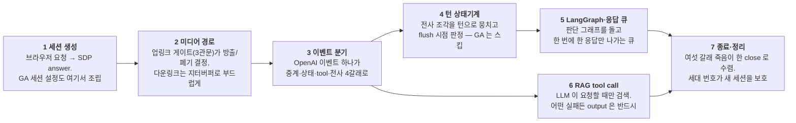
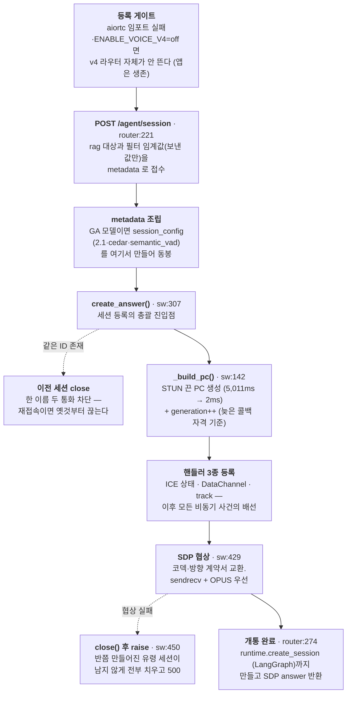
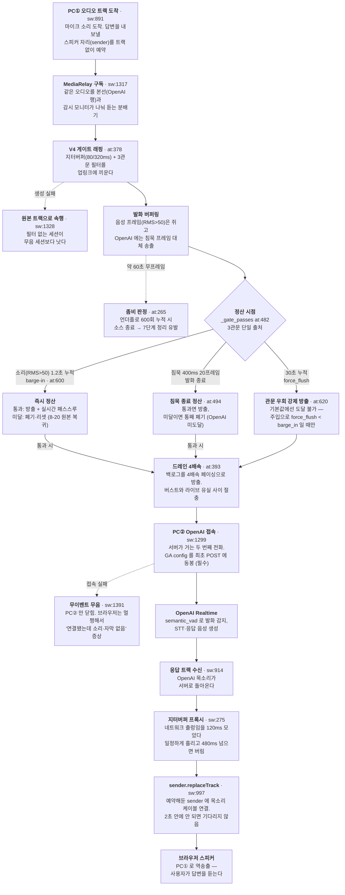
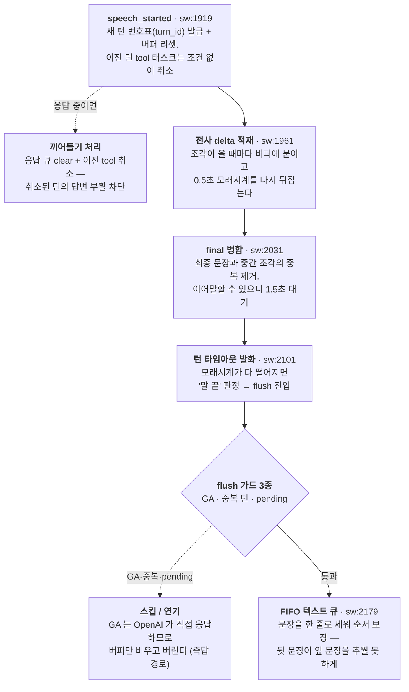
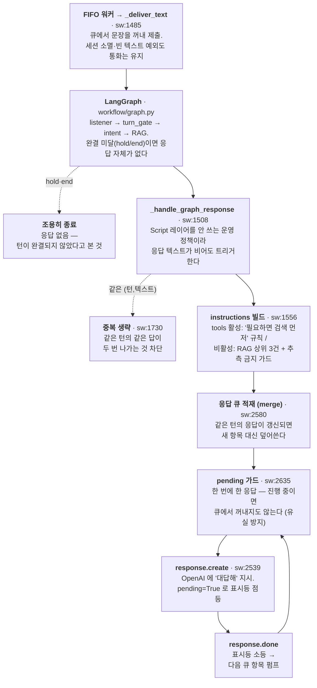
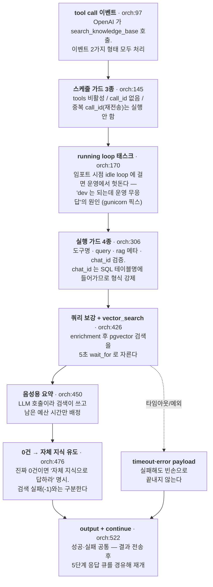
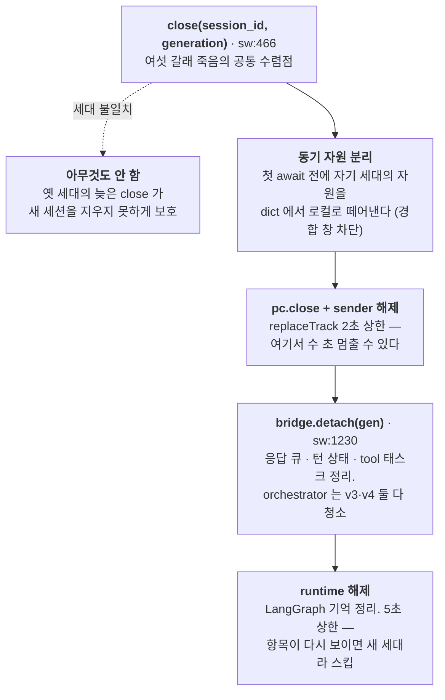

---
tags:
  - 아사달
  - 프로젝트
  - AI음성
  - 아키텍처
created: 2026-08-10
updated: 2026-08-20
---

# AI음성 - 런타임 플로우

> [!summary] 한 줄 요약
> v4 통화 하나의 생애 전체를 **7단계**(세션 생성 → 미디어 경로 → 이벤트 분기 → 턴 상태기계 → LangGraph·응답 큐 → RAG tool call → 종료·정리)로, 예외 경로까지 포함해 정리했다. 진행 상황은 [[AI음성]], 어느 파일을 고쳐야 하는지는 [[AI음성 - 파일·함수 레퍼런스]] 참고.

> [!warning] 2026-08-20 원본 임계값 복귀 + 1.2초 상향 반영
> 8-18 판은 완화 임계값(200ms/500ms/RMS120)과 P1-1(barge-in 실패 시 누적 유지) 기준이었다. 이후 사용자 결정으로 **게이트가 원본(v2.6.7) 기준으로 되돌아갔다** — 8-19 임계값 원본 복귀(1000/3/300/600) 후 min_utterance·barge_in 만 **1200** 으로 상향, 8-20 **barge-in 정산(관문 미달 시 폐기·리셋) 복귀**(P1-1 되돌림)와 **cedar 음성 복원**, 그리고 **침묵 종료만 60ms → 400ms 재상향**(어절 사이 쉼 조각화 방지). 드레인 4배속(P1-2)과 force_flush 관문 우회는 유지된다. 이 판은 `fix/v4-session-generation-guard-dev` `307f5d6` 코드 기준이다. 위치 표기: `router:` = voice_chat_v4_router.py, `sw:` = server_webrtc.py, `at:` = v4/audio_tracks.py, `orch:` = v4/tool_call_orchestrator.py.

## 전체 구조

브라우저가 통화를 시작하면 세션을 만들고(1), 통화 중에는 오디오(2)와 이벤트 처리(3~6)가 **동시에** 돌고, 끝나면 어느 경로로 죽었든 같은 절차로 정리한다(7).



설계 원칙이 세 개다. **오디오와 RAG 는 병렬**이라 검색이 수 초 걸려도 중계가 멈추지 않는다. **응답은 한 번에 하나**라 모든 응답이 같은 큐를 거친다. **모든 늦은 콜백은 세대(generation) 번호로 자격을 확인**한다.

v3 와의 차이는 [[v3와 v4 아키텍처]] 참고. v3 는 서버가 오디오를 안 만지고, v4 는 서버가 양쪽 피어를 직접 붙든다.

##### 스트림 구조 — 오디오와 이벤트는 어떤 관계인가

"오디오 라인과 이벤트 라인이 따로 있는가, 아니면 한 라인에서 갈라지는가" 는 둘 다 아니다. **WebRTC 연결 하나가 미디어 트랙(오디오 RTP)과 데이터채널(이벤트 JSON)을 동시에 나른다** — 같은 연결의 서로 다른 채널이다. 그리고 v4 는 그런 연결이 **두 개**다.

| 연결 | 구간 | 나르는 것 |
|---|---|---|
| PC① | 브라우저 ↔ 서버 | 마이크 오디오(상행) · 응답 음성(하행) · 이벤트 중계(하행) · 텍스트 입력(상행) |
| PC② | 서버 ↔ OpenAI | 중계 오디오(상행) · 응답 음성(하행) · 이벤트 원본(양방향) |

**이벤트는 오디오에서 분기되어 나오는 것이 아니다.** 서버가 오디오를 뜯어 자막이나 상태를 만드는 게 아니라, OpenAI 가 오디오를 듣고 **새로 생성해서** 데이터채널로 보내준다. 서버는 오디오의 내용(말뜻)을 모른다 — RMS(음량)만 잰다. 다만 8-14 게이트 복원 뒤로는 그 음량 통계가 **통과/폐기를 결정**한다: 2단계 게이트가 관문 판정으로 발화를 방출하거나 통째로 버린다(버려진 오디오는 OpenAI 에 도달하지 않는다).

## 1 · 세션 생성 — 전화 개통

브라우저의 요청부터 SDP answer 반환까지. 그 전에 서버 기동 시점의 **등록 게이트 2종**이 있다.



| 노드 | 위치 | 하는 일 |
|---|---|---|
| aiortc 임포트 실패 | voice_router:18 | WebRTC 라이브러리가 없으면 v4 라우터 자체를 None 으로 만들어 앱 전체가 죽는 것을 막는다 |
| `ENABLE_VOICE_V4=off` | voice_router:35 | 코드 배포 없이 v4 를 끄는 비상 스위치. 기본은 on 이고, 알 수 없는 값이면 조용히 꺼지지 않도록 기본값을 유지한다 |
| POST /agent/session | router:221 | 어느 챗봇 지식을 볼지(`rag_db`·`rag_chat_id`), 필터 임계값(보낸 값만)을 metadata 로 묶는다. GA 모델은 첫 요청에 세션 설정을 함께 보내야 해서 여기서 만든다 |
| 기존 same-id close | sw:319 | 재접속으로 같은 이름의 통화가 있으면 옛것을 먼저 끊는다. 한 이름 두 통화 차단 |
| `_build_pc()` | sw:142 | STUN 을 끈 PC 를 만든다. 어댑터 11개 순회로 **5,011ms → 2ms**. `ENABLE_SERVER_STUN=on` 으로 복귀 가능 |
| `generation++` | sw:330 | 전역 단조 증가 세대 번호. 같은 이름의 몇 번째 세션인지 구분하는 주민번호로, 이후 모든 늦은 콜백의 자격 기준이다 |
| SDP 협상 | sw:429 | 코덱·방향 계약서 교환. 트랜시버를 sendrecv 로 열고 OPUS 를 우선시킨다 |
| 협상 실패 | sw:450 | 등록한 세션 상태를 전부 close() 로 치우고 500. 안 치우면 반쯤 만들어진 유령이 영원히 남는다 |
| answer 반환 | router:274 | LangGraph 대화 세션(`runtime.create_session`)까지 만들어야 개통 완료다 |

## 2 · 미디어 경로 — 소리가 다니는 길

업링크(브라우저→OpenAI)와 다운링크(OpenAI→브라우저). 서버는 두 PeerConnection 의 한가운데 앉아 있다. **업링크는 8-14 복원된 게이트다** — 발화를 버퍼에 쥐고 관문 판정으로 방출/폐기를 결정하며, 버퍼링 중에는 침묵 프레임을 대신 내보낸다.



| 노드 | 위치 | 하는 일 |
|---|---|---|
| 트랙 도착 + sender 예약 | sw:891 | 마이크 소리가 도착하면, 나중에 답변을 내보낼 스피커 자리(sender)를 **트랙 없이** 예약해 둔다 |
| MediaRelay 구독 | sw:1317 | 같은 오디오를 본선(OpenAI 행)과 감시용 모니터가 나눠 듣는 분배기 |
| V4 게이트 | at:378 | 업무 지시로 복원된 필터. 음성 프레임(RMS>50)을 버퍼에 쥐고 침묵 프레임을 대신 내보내다가, 관문을 통과해야 방출한다. 폐기된 발화는 OpenAI 에 도달하지 않는다 — 무반응의 직접 원인이 될 수 있어 채택/폐기 판정을 info 로 남긴다 |
| 3관문 (원본 복귀 + 8-20 조정) | at:482 | ① 발화 길이 **1200ms** ② 실발화(RMS>**600**) 누적 **900ms** ③ 실발화 비율 **30%**. `_gate_passes()` 가 부작용 없는 단일 출처다. 8-19 원본(1000/300/600) 복귀 후 min_utterance 만 1200 상향 — 상세는 아래 [[#게이트 파라미터 (2026-08-20 기준)]] 표 참고. 7필드 전부 세션 생성 요청으로 주입 가능(router:72) |
| 발화 종료 판정 | at:410 | 연속 침묵 **20프레임(400ms)** 이면 발화 종료 → 정산. 원본값 3(60ms)은 어절 사이 쉼마다 발화를 쪼개 통째 소실을 만들어(8-14 실측) 8-20 에 400ms 로 재상향했다 |
| barge-in | at:600 | **소리(RMS>50) 누적 1.2초** 도달 시 침묵을 기다리지 않고 **즉시 정산** — 트리거는 voice_duration 이고, 그 시점에 3관문 전체(실발화 900ms·비율 30% 포함)를 검사한다. 관문 통과면 방출 + 실시간 패스스루 전환, 미달이면 **폐기·리셋**(8-20 원본 동작 복귀, P1-1 되돌림). 패스스루는 침묵 400ms(20프레임)에 해제 |
| force_flush | at:620 | 30초 누적 시 **관문을 우회**해 강제 방출. 단 barge-in 정산 복귀로 관문 미달 발화가 1.2초 주기로 계속 폐기되므로 **기본값에서는 도달 불가** — 세션 주입으로 force_flush < barge_in 인 구성에서만 유효한 안전장치다 |
| 드레인 4배속 | at:393 | 방출된 발화 뭉치를 실시간의 4배속으로 송출(P1-2 유지). 버스트(수신측이 앞부분 폐기)와 1배속(드레인 동안 라이브 유실) 사이의 절충 — barge-in 백로그(~1.2초)가 300ms 에 비워져 라이브 무손실 |
| 필터 생성 실패 | sw:1328 | 게이트 설치가 실패해도 원본 트랙으로 통화를 계속한다. 필터 없는 세션이 무음 세션보다 낫다 |
| 약 60초 무프레임 | at:265 | 지터버퍼 언더플로 600회(≈60초) 누적 시 유령으로 판정하고 소스를 종료해 정리를 유발한다 (기반 클래스 좀비 가드) |
| PC② OpenAI 접속 | sw:1299 | 서버가 거는 두 번째 전화. GA 모델은 세션 설정을 최초 POST 에 실어야 하며, 안 실으면 스키마 검증에서 죽는다 |
| 접속 실패 | sw:1393 | PC② 만 닫고 반환한다. 브라우저 쪽은 멀쩡해서 **"연결은 됐는데 소리도 자막도 없는"** 증상이 된다 — v4 무음 사건의 형태다 |
| 지터버퍼 프록시 | sw:275 | 다운링크. 네트워크 출렁임을 **120ms** 모았다 일정하게 흘리고 **480ms** 넘으면 버리는 물탱크 |
| replaceTrack | sw:997 | 예약한 sender 에 목소리 케이블을 꽂는다. **2초** 안에 안 되면 기다리지 않고 진행. sender 자체가 없으면 송출만 포기하고 경고 |

### 게이트 파라미터 (2026-08-20 기준)

`NoiseFilteredAudioProxyTrackV4` 생성자 기본값. 7개 필터 필드는 전부 세션 생성 요청으로 챗봇·환경별 주입이 가능하다(router:72 — 안 보낸 값만 기본값 사용).

| 파라미터 | 값 | 한글 이름 | 설명 |
|---|---|---|---|
| `min_utterance_duration_ms` | **1200** | 최소 발화 길이 | 발화 전체(RMS>50 누적)가 1.2초 미만이면 통째 폐기. 응답 중 짧은 발화가 끼어들기로 오인되는 것을 막는 목적(8-19 상향). 대가로 평시 "네." 같은 짧은 대답도 폐기된다 |
| `silence_threshold_rms` | **50** | 무음 경계 음량 | 프레임 RMS 가 50 초과면 "소리 있음" — 버퍼 축적 + voice_duration 누적. 이하면 침묵 프레임 |
| `silence_frames_to_end` | **20** (400ms) | 발화 종료 판정 침묵 | 연속 침묵 20프레임이면 발화 종료 → 정산. 패스스루 해제 판정도 같은 값. 원본 60ms 는 쉼마다 발화를 쪼개 8-20 재상향 |
| `speech_rms_threshold` | **600** | 진짜 발화 음량 기준 | RMS 600(≈ -35dBFS, 풀스케일 1.8%) 초과 프레임만 "진짜 말"로 집계(speech_duration). 순수 음량 기준이라 큰 소음도 집계되고 조용한 말은 누락된다 — 내용 판단이 아니다. 원본 300 → 8-20 상향, OpenAI VAD 하한(120)의 5배라 모바일 취약 |
| `min_speech_duration_ms` | **900** | 진짜 발화 최소 누적 | 진짜 말 프레임의 누적이 900ms 이상이어야 통과. 비율이 아니라 **절대 시간**이며, 연속일 필요 없이 발화 안에서 합산한다. 원본 600 → 8-20 상향으로 barge-in 시점 실질 비율 요구가 **75%** 가 됐다 |
| `speech_ratio_threshold` | **0.30** | 진짜 발화 비율 | speech÷voice ≥ 30%. 배경소음이 길게 깔린 발화(비율 4~18% 실측)를 차단하는 시간 비율 |
| `barge_in_ms` | **1200** | 끼어들기 판정 시간 | 소리(voice, RMS>50) 누적 1.2초 도달 시 즉시 정산 — 3관문 통과면 방출 + 패스스루, 미달이면 폐기·리셋 |
| `force_flush_ms` | **30000** | 강제 방출 안전장치 | 관문 반복 실패 시 30초 후 관문 우회 방출. 기본값에서는 barge-in 정산이 선행해 도달 불가 |
| `_DRAIN_SPEEDUP` | **4** | 드레인 배속 | 통과 발화 백로그를 4배속 페이싱으로 방출 (주입 불가, 클래스 상수) |
| `target/max_buffer_ms` | **80 / 320** | 업링크 지터버퍼 | 프레임 도착 출렁임 흡수 목표/상한 (기반 클래스) |

판정 흐름 한 줄 요약.

```
프레임(20ms)마다:  RMS > 50 → voice 누적,  RMS > 600 → speech 도 누적
정산 시점:  소리 1.2초 누적(barge-in) / 침묵 400ms(발화 종료) / 30초(force_flush)
3관문 AND: voice ≥ 1200ms  ∧  speech ≥ 900ms  ∧  speech/voice ≥ 30%
통과 → 드레인 4배속 방출  ·  미달 → 통째 폐기 (OpenAI 미도달)
```

### GA 세션 설정 (모델·음성·VAD)

`constants.py` 의 `WEBRTC_VOICE_CONVERSATION_CONFIG_GA`. 1단계에서 조립돼 PC② 최초 POST 에 실린다. **v3 GA 세션도 같은 config 를 공유한다.**

| 설정 | 값 | 설명 |
|---|---|---|
| 모델 | `gpt-realtime-2.1` | GA 리얼타임 모델. 프론트 기본값(voice_runtime.js)도 2.1 이라 실통화는 항상 GA 경로다 |
| `voice` | **cedar** | 응답 음성. marin 대비 발음이 또렷하고 자연스러움(원본 v4 확정 결정). 전면 롤백에 유실됐던 것을 8-20 복원 |
| `turn_detection.type` | `semantic_vad` | 음량 + 의미적 완결성으로 발화 종료 판단. 소음 오탐에 강함 |
| `eagerness` | `low` | 종료 판정 신중 모드 — 말 중간 짧은 침묵·소음에 섣불리 반응하지 않음 |
| `interrupt_response` | `True` | 사용자 발화 감지 시 진행 중 응답을 OpenAI 가 자동 중단. **도달한 오디오면 길이와 무관하게 끊는다** — 서버 게이트 수치는 "도달 여부"만 통제한다 |
| `create_response` | `True` | 발화 종료 즉시 OpenAI 가 스스로 응답 생성(GA 즉답 경로). 서버 flush 는 GA 가드로 스킵 |
| `noise_reduction` | `far_field` | OpenAI 서버측 원거리 마이크 배경소음 감쇄. 서버 게이트와 독립인 이중 방어 |
| `transcription` | `gpt-4o-transcribe` / ko | 입력 음성 전사 (턴 상태기계·자막의 재료) |
| `output_modalities` | `["audio"]` | 음성만 생성. 텍스트는 `response.audio_transcript.*` 이벤트로 별도 수신 |
| `reasoning.effort` | `low` | 응답 지연 최소화 |
| `instructions` | 한국어 음성 비서 | + `search_knowledge_base` 는 **내부 문서 필요 질문에만** 호출(8-19 재한정). search_web 지시는 미등록 도구 잔재라 제거됨(8-19) |

> [!info] 게이트의 실측 성적 — 완화값 기준이었다 (2026-08-18)
> A/B/C 재측정에서 원본급 임계값은 깨끗한 문장 조각 6개 중 1~2개만 도달시켰고, 완화값(200ms/500ms/RMS120) 사전 검증에서는 **소실 0건**이었다. 소음 차단 이득은 0 으로 실측됐다 — 굉음·지속 소음은 OpenAI `semantic_vad` + far_field 가 게이트 없이도 무시한다.
>
> 8-19~20 원본 복귀 + 1.2초 상향으로 소실 비용 일부가 다시 유효해졌다 — 1.2초 미만 짧은 대답 폐기, barge-in 정산 복귀로 저음량 연속 발화의 1.2초 주기 반복 폐기(force_flush 도달 불가). 다만 **쉼 조각화는 침묵 판정 400ms 재상향(8-20)으로 다시 막았다** — 400ms 미만의 어절 사이 쉼은 발화를 쪼개지 않는다. 끼어들기 오탐 방지를 우선한 사용자 결정이며, dev 배포 후 재측정으로 비용을 확인한다.

## 3 · 이벤트 분기 — 한 이벤트가 네 갈래

OpenAI 의 모든 소식(자막·말 시작/끝·도구 요청·응답 완료)이 PC② 의 `oai-events` 채널 하나로 오고, 수신 가드를 통과하면 **네 갈래를 순서대로 모두** 거친다. 병렬이 아니라 같은 콜백 안의 순차 실행이며, tool call 만 `create_task` 로 띄워 그 이후가 비동기다. 콜백 본체는 `sw:2435`.

수신 가드 3종 — 해당 시 즉시 폐기.

| 가드 | 이유 |
|---|---|
| UTF-8 디코드 실패 | 글자로 읽을 수 없는 메시지 |
| JSON 파싱 실패 | 처리할 수 없는 형식 |
| **세대 불일치** (sw:2453) | 같은 이름으로 새 세션이 생긴 뒤 옛 세대의 늦은 이벤트가 오면, 현재 세션의 v3/v4 플래그를 읽어 **다른 쪽 orchestrator 로 흘러간다** — v3/v4 격리가 깨지는 지점이라 세대 번호로 차단한다 |

| 갈래 | 위치 | 하는 일 |
|---|---|---|
| ① 브라우저 중계 | sw:2316 | 이벤트 원문을 브라우저 DataChannel 로 그대로 넘긴다. 프론트가 자막·끼어들기를 그리는 재료다. 유일한 예외가 **tool 제어 이벤트 차단**(sw:2297) — 프론트가 v3 습관대로 자기도 도구를 실행해 응답이 중복되고 "다른 창에서 이미 실행 중" 오류가 뜨는 것을 막는다. 중계 실패는 경고만 남기고 뒤 처리를 계속하며, `response.done` 뒤엔 `token_usage` 를 별도 전송한다 |
| ② 상태 이벤트 | sw:1746 | `speech_started/stopped` 는 4단계로. `response.created` 는 **pending 표시등**을 켠다 — GA 가 스스로 만든 응답까지 추적해 tool 재개가 진행 중 응답 위에 얹히는 것을 막는다. `response.done` 은 표시등을 끄고 응답 큐의 다음 항목을 펌프한다 |
| ③ tool call 추출 | orch:97 | 도구 요청을 뽑아 6단계로 넘긴다. 중복 `call_id` 는 장부로 차단 |
| ④ 전사 추출 | sw:1646 | 받아쓰기를 두 서랍으로 나눈다. **사용자 말**(`input_audio_transcription*`)은 턴 버퍼로, **AI 말**(`response.audio_transcript*`)은 기록용 자막 로그로. 섞으면 AI 가 자기 말에 자기가 대답하는 루프가 생긴다 |

브라우저 채널 쪽에도 역방향 진입점이 하나 있다. 프론트가 보내는 텍스트 입력은 제어 JSON 판별(`_is_browser_control_message`, sw:122 — **원문 기준** 판정)을 거쳐 runtime 으로 직행한다. 제어 메시지를 안 거르면 RAG 이중 실행 + 버퍼 누적이 생긴다 — 8-13 재이식 수정.

##### AI 가 자기 말에 자기가 대답하는 루프

갈래 ④ 의 분기가 왜 필요한지는 사고 시나리오로 봐야 이해된다. 문제의 뿌리는 **두 전사가 형태상 구별되지 않는다**는 데 있다 — 사용자 말(`input_audio_transcription.*`)이든 AI 대본(`response.audio_transcript.*`)이든, 텍스트만 보면 똑같이 생긴 한국어 문장이다. `_extract_transcript` 는 둘 다 잡아낸다.

AI 대본까지 턴 버퍼로 흘려보내면 이렇게 된다.

```
AI: "안녕하세요, 무엇을 도와드릴까요?"
 → 그 대본이 턴 버퍼에 쌓임 (서버가 사용자 말로 오인)
 → 타이머 만료 → flush → LangGraph 에 사용자 발화로 제출
 → 응답 지시 → AI: "네, 무엇이든 물어보세요"
 → 또 대본이 옴 → 처음으로
```

막는 것은 조건 한 줄이다(sw:2519) — 사용자 입력일 때만 턴 버퍼로 보내고, AI 대본은 `_capture_assistant_transcript` 로 보내 **로그와 프론트 중계에만** 쓴다. 코드에도 `# 사용자 입력만 처리 (AI 응답인 response.audio_transcript는 제외!)` 로 못박혀 있다.

층위가 다른 비슷한 루프가 하나 더 있다 — 스피커에서 나온 AI 목소리가 **마이크로 되들어가** 진짜 사용자 발화로 전사되는 음향 에코다. 이건 브라우저의 `echoCancellation` 이 담당하며, 뚫리면 위 코드 가드로는 못 막는다(OpenAI 가 사용자 발화로 전사해 보내기 때문). 이어폰 없이 스피커 볼륨을 크게 두고 테스트할 때 주의한다.

GA 세션에서는 flush 가 어차피 스킵되므로 위 5단계 루프가 실제로 터지지는 않는다. 이 가드의 실질적 보호 대상은 v2/legacy 경로이고, 공용 코드라 양쪽 모두에 필요하다.

## 4 · 턴 상태기계 — 말 끝났나 판정

받아쓰기 조각을 "한 번의 발언(턴)"으로 뭉치고 언제 처리할지 결정한다. 상태는 `idle → listening → buffering → processing → responding`, `response.done` 이 오면 idle 로, 발화가 감지되면 어디서든 listening 으로.



| 단계 | 위치 | 하는 일 |
|---|---|---|
| speech_started | sw:1919 | 새 턴 번호표 발급 + 버퍼 리셋. **끼어들기 판정**은 상태 문자열만 보면 GA 자동 응답을 놓치므로 `responding ∥ pending ∥ 큐 잔량` 을 함께 본다. 이전 턴의 tool 태스크는 **조건 없이 취소** — 안 끊으면 늦게 끝난 RAG 가 취소된 턴의 답변을 되살린다 |
| delta 적재 | sw:1961 | 조각이 올 때마다 버퍼에 붙이고 **0.5초** 모래시계를 뒤집는다. 단독 문장부호는 정규화에서 버린다 |
| final 병합 | sw:2031 | 최종 문장이 오면 중간 조각과 겹치는 부분을 제거하고, 이어 말할 수 있으니 **1.5초** 를 기다린다 |
| 타임아웃 발화 | sw:2080 | 모래시계가 다 떨어지면 "말 끝" 판정, flush 진입 |
| flush 가드 ① GA | sw:2125 | **v4 + GA 모델이면 버퍼만 비우고 스킵.** GA 는 발화 종료 즉시 OpenAI 가 직접 응답·tool call 을 처리하므로(즉답 경로), 서버가 또 시키면 한 질문에 답이 둘 생긴다. v4 마커를 함께 보는 이유: 이 브릿지는 v2 와 공유되고 v2 GA 는 LangGraph 가 유일한 응답 경로다 |
| flush 가드 ② 중복 턴 | sw:2135 | 같은 턴 두 번 제출 방지 |
| flush 가드 ③ pending | sw:2143 | AI 가 말하는 중이면 연기하고 타이머 재예약 |
| FIFO 큐 | sw:2170 | 문장들을 한 줄로 세워 순서대로 처리 — 빨리 끝난 뒷 문장이 앞 문장을 추월하지 못하게. 워커 종료 시 **매핑이 자기 자신일 때만** 정리하고(재접속 경합 방어), 잔여 항목이 있으면 즉시 재스폰한다. detach 는 큐를 먼저 지우므로 종료 경로에선 재스폰되지 않는다 — 8-13 재이식 + Codex 보강 |

### 용어 정리 — 번호표·버퍼·final·타이머

**번호표(turn_id)** — 사용자 발언 한 번(턴)마다 발급하는 UUID 다. LLM 응답에 따로 번호를 매기지 않고, 그 턴에서 파생된 검색·응답 큐 항목·response.create 가 같은 번호를 **상속**한다. 용도는 셋 — 중복 제출 방지(`submitted_turns`), 끼어들기로 무효가 된 턴의 응답 부활 차단, 응답 중복 감지 키. tool call 의 `call_id` 는 별개 번호표로, OpenAI 가 발급하며 같은 검색 요청의 재실행 방지에만 쓴다.

**버퍼(ctx.buffer)** — 사용자 입력 전사 조각(delta)을 이어 붙이는 문자열 하나다. 턴이 확정되는 순간 통째로 LangGraph 에 넘긴다. AI 응답 자막은 여기 들어가지 않는다 — 별도 버퍼에 모아 **로그로만** 남긴다.

**final 판정 주체** — 서버가 아니라 **OpenAI Realtime** 이다. 입력 전사 이벤트의 타입 이름이 `completed/final/done` 으로 끝나는지만 본다(sw:1669). 서버는 문장 완결을 판단하지 않는다.

**final 병합의 의미** — 이어말한 내용을 지우는 게 아니다. STT 가 같은 발화에 대해 중간본과 최종본을 **둘 다** 보낼 때, 최종본이 기존 버퍼를 접두/접미로 포함하면 버퍼를 최종본으로 교체해 "안녕하세요 안녕하세요" 식 이중 기록을 막는 것이다. 이어말한 새 조각은 그대로 append 된다.

| 타이머 | 값 | 의미 |
|---|---|---|
| delta 타임아웃 | **0.5초** | 조각이 올 때마다 리셋("모래시계 뒤집기"). 마지막 조각 후 0.5초 침묵 = 말 멈춤. final 유실 안전망 겸용 |
| vad_final 타임아웃 | **1.5초** | 문장이 확정돼도 이어말할 수 있으니 대기. 이 안에 새 조각이 오면 같은 턴으로 묶인다 |

> [!danger] 두 값은 **합산되지 않는다** — 0.5 + 1.5 = 2초가 아니다
> 같은 슬롯(`ctx.timeout_handle`)을 **교체**하며 쓴다. `_schedule_turn_timeout` 의 첫 동작이 기존 핸들 `cancel()` 이다.
>
> 게다가 final 전사가 오면 `_handle_transcript_text` 가 **한 함수 안에서 두 번** 예약한다 — 공통 경로에서 0.5초를 걸고(sw:1974), 곧바로 `if is_final:` 블록에서 1.5초로 덮는다(sw:2000). 그 사이에 `await` 가 없어 단일 스레드 루프에서는 다른 코드가 끼어들 수 없다. **①의 0.5초는 한 번도 터지지 않는다** — 실질 대기는 1.5초 하나다.
>
> 0.5초가 실제로 발화하는 것은 final 이 **안 올 때**뿐이다(전사 이벤트 유실 등). `_handle_speech_stopped` 가 걸어둔 0.5초가 터져 버퍼 내용으로 flush 하는 안전망 경로다.
>
> ```
> delta, delta, delta …   → 0.5초가 계속 뒤로 밀림
> speech_stopped          → 0.5초 재설정
> final 전사 도착         → 0.5초 취소 후 1.5초 설정   ← 여기부터 실측 대기
>    ↓ 1.5초 침묵
> flush
> ```
>
> 기준점도 주의한다. 타이머는 사용자가 입을 다문 순간이 아니라 **전사 이벤트가 서버에 도착한 시점**부터 잰다. 체감 대기는 `STT 지연 + 1.5초` 다.

> [!warning] 현재 운영(GA)에서는 이 타이머가 응답 속도와 무관하다
> 운영 모델 `gpt-realtime-2.1` 은 GA 이고, GA 세션 설정은 `create_response: true` 다(constants.py:136). **OpenAI 가 `semantic_vad` 로 발화 종료를 판단해 스스로 즉시 응답**하며 서버 허락을 기다리지 않는다.
>
> 타이머는 여전히 돌지만 — 전사가 오면 `_schedule_turn_timeout` 이 걸린다 — 만료되어 flush 에 도달하는 순간 GA 가드에 걸려 **버퍼만 비우고 폐기**된다. 즉 GA 경로에서 0.5/1.5초는 **헛도는 작업**이고, 사용자가 체감하는 즉답이 정상이다. 이 타이머가 실제로 응답 타이밍을 정하는 것은 Legacy 모델(v2, v4-legacy) 경로뿐이다.
>
> 8-12 [[AI음성 - v4 응답 지연 원인 규명과 GA 즉답 경로 복원|GA 즉답 경로 복원]] 이 노린 것이 정확히 이 상태다. 그 전에는 자동 응답을 끄고 서버 경로만 남겨서 전사 대기 + 1.5초 + Decision LLM 을 전부 타느라 응답이 수 초 늦었다.

**delta 조각의 단위** — OpenAI 가 정하고 서버는 단위를 가정하지 않는다. 그냥 문자열을 이어붙일 뿐이다. 일반적으로 STT delta 는 모델이 확정한 만큼 나오는 토큰~어절 단위지만, 코드는 방어적이다 — `_capture_assistant_transcript` 가 조각을 붙이기 전에 `if text not in current` 로 중복을 확인하는데, 이는 delta 가 증분일 수도 누적본일 수도 있다는 전제다. 정확한 실측 단위가 필요하면 dev 로그의 전사 이벤트를 뽑아 확인한다.

**Realtime 모델은 음성과 텍스트를 둘 다 준다** — 음성은 RTP 미디어 트랙(Opus)으로, 텍스트는 데이터채널의 `response.audio_transcript.delta/.done` 으로. 서버가 응답 음성을 받아쓰는 것이 **아니라**, OpenAI 가 자기가 말한 음성의 대본을 함께 보내준다. 세션이 `output_modalities: ["audio"]` 인데도 그렇다 — constants.py:63 의 "신모델은 audio+text 동시 미지원, transcript 이벤트로 텍스트 수신" 주석이 이 이야기다. 서버는 이 대본을 로그로 남기고 프론트로 중계해 화면 자막이 되게 한다.

### Tool-Only 모드 — 제거됨 (2026-08-13)

과거 flush 가드에는 네 번째 분기가 있었다. 턴마다 "이번 턴 질문: {질문}. `search_knowledge_base` 도구를 **먼저** 호출해 근거를 확보한 뒤 답변하라" 는 지시를 실어 LangGraph 없이 바로 response.create 를 보내는 Tool-Only 모드다. 일반 경로("검색이 **필요한** 질문이면 먼저 호출")와 달리 모든 턴에 검색을 강제해, 켜지면 인사말에도 검색부터 돌았다.

켜는 키(`v15_tool_only`·`tool_only_mode`·`realtime_tool_only`)를 세팅하는 코드가 저장소에 **0건**이라 도달 불가능한 분기였다 — 이론상 유일한 경로는 v2 세션 요청의 클라이언트 metadata opt-in(voice_chat_v2_router:106)뿐. 키 이름의 v15 가 말하듯 v1.5 실험기의 스위치로, 2026-04-08 원본 덤프(`2f9e78b`)에 실려 들어온 것이었다.

v2 계약 포함 통째로 제거했다 — 커밋 `0ef439b`(-dev) / `3e43324`(원본), 메서드 2개 + flush 분기 + 테스트 스텁 **39줄 삭제**, flush 가드 4종 → **3종**. pytest 173 passed(기존 환경 실패 1건 별개), Codex 리뷰 클린 통과.

## 5 · LangGraph → 응답 큐

flush 를 통과한 문장이 판단 그래프를 돌고, 결과로 OpenAI 에게 "대답해" 를 시킨다. 실제 문장과 목소리는 OpenAI 가 만들고 서버는 재료와 지시만 준다.



| 단계 | 위치 | 하는 일 |
|---|---|---|
| `_deliver_text` | sw:1485 | `submit_user_text` 호출. 세션이 이미 정리됐거나(KeyError) 빈 텍스트면(ValueError, `vad_final` 은 허용) 예외가 나지만 로그만 남기고 통화는 유지한다 |
| LangGraph | workflow/graph.py | `listener`(발화 수집) → `turn_gate`(완결 판정 — hold/end 면 여기서 끝, 응답 자체가 안 나감) → `intent_planner`(RAG 필요 판단) → 조건부 `retriever`(FAISS) → finalize |
| graph_response | sw:1508 | Script 레이어를 안 쓰는 운영 정책이라 **응답 텍스트가 비어도 response.create 를 트리거**한다 |
| instructions | sw:1556 | tools 활성이면 "필요하면 `search_knowledge_base` 먼저" 규칙을, 비활성이면 RAG 상위 3건 스니펫 + "근거 밖 추측 금지" 가드를 주입한다 |
| 큐 적재 | sw:2580 | 같은 턴의 응답이 갱신되면 새 항목 대신 덮어쓴다(merge) |
| pending 가드 | sw:2635 | **한 번에 한 응답.** 진행 중이면 큐에서 꺼내지도 않는다 — 예전엔 popleft 부터 해서 거부당한 항목이 증발했다. `response.done` 이 오면 이 함수가 다시 불려 그때 나간다 |
| tool 재개 합류 | sw:2617 | tool 결과 이후의 재개 응답도 **같은 큐**에 태운다. 별도 경로로 보내면 두 응답이 서로 모른 채 동시에 나가 거부당한다 |

## 6 · RAG tool call

서버가 "검색이 필요하다" 를 판단하지 않는다. **LLM 이 함수 호출을 내보내면** 그때 실행한다. 원칙은 하나 — **어떤 실패든 반드시 output 을 보내고 응답을 재개한다.** 안 보내면 OpenAI 가 하염없이 기다려 통화가 영원히 조용해진다.



| 단계 | 위치 | 하는 일 |
|---|---|---|
| 스케줄 가드 | orch:145 | tools 비활성 / call_id 없음 / **중복 call_id**(재전송 대응) 는 실행 자체를 안 한다 |
| running loop | orch:170 | 모듈 임포트 시점의 idle loop 에 태스크를 걸면 gunicorn 운영에서만 헛돈다 — "dev 는 되는데 운영은 무응답" 의 원인이었다 |
| 실행 가드 | orch:306 | 도구명 불일치(unsupported) / query 없음(invalid) / rag 메타 없음(missing_context) / **chat_id 검증** — UUID 해석 실패 시 진행하지 않고 에러로 끝내고, `_SAFE_CHAT_ID_RE` 로 형식을 강제한다. 이 값은 SQL 테이블명 `td_{chat_id}_...` 에 **그대로 interpolate** 되므로 여기서 못 막으면 원인이 지워진 SQL syntax error 로만 나타난다 |
| top_k | orch:25 | `_to_top_k` 는 OverflowError 까지 잡는다(`10**400`, `"1e309"`). 이 코루틴은 태스크로 돌아 예외가 조용히 삼켜지므로, 파싱 예외 = tool 응답 미전송 = 세션 행이다. 요청→메타→기본 5, **1~10 클램프** |
| 검색 | orch:426 | 쿼리 보강(enrichment) 후 `vector_search` 를 **5초**(`VOICE_CHAT_FUNCTION_TOOL_TIMEOUT_SECONDS`) `wait_for` 로 자른다. `results` 는 미리 None 초기화 — 타임아웃 경로의 UnboundLocalError 방지 |
| 음성용 요약 | orch:450 | `summarize_for_voice` 는 LLM 호출이라 **전체 예산에서 검색이 쓰고 남은 시간**만 준다. 예산 소진이면 answer 없이 보낸다 — 요약 누락이 세션 행보다 낫다 |
| 0건 vs 실패 | orch:476, 518 | 진짜 0건이면 "자체 지식으로 답하라" 를 명시(침묵 방지). 검색이 실패한 경우는 `result_count=-1` 로 구분해 그 지시를 내보내지 않는다 — 실패를 0건으로 오인시키지 않기 |
| output + continue | orch:522 | 어느 경로로 끝났든 `function_call_output` + 재개를 보낸다. 재개는 매니저가 사후 주입한 dispatcher(`_enqueue_tool_continue_response`)로 **5단계의 큐를 경유**한다 — 직접 보내면 진행 중 응답과 충돌한다 |

> [!warning] 이 단계의 모든 종료 경로는 응답을 보내야 한다
> `_handle_function_tool_call()` 은 태스크로 돌기 때문에 예외가 조용히 삼켜진다. 응답을 안 보내고 끝나면 OpenAI 는 tool 결과를 영원히 기다리고 통화가 멈춘다. 실제로 두 번 터졌다 — `results` 미바인딩, `top_k` OverflowError. 새 분기를 추가하면 반드시 output + continue 쌍을 태우거나 `_send_tool_error()` 로 끝낼 것.

##### 검색 엔진과 후처리 (2026-08-14 확인)

**엔진은 pgvector 다. FAISS 가 아니다** — 호출 경로가 `chat/faiss_process.py` 라 오해하기 쉽지만, 음성 경로가 부르는 함수는 그 파일 안의 `pgvector_search` 다. `rag_adapter.py` 의 docstring 도 "main RAG 의 통합 vector_search 대신 pgvector 단일 경로를 사용"이라고 못박고 있다. 대상 테이블은 `td_{chat_id}_training_data`(영상은 `td_{chat_id}_timestamp_data` 결합).

검색은 **벡터 + TRGM 하이브리드**다.

| 단계 | 내용 |
|---|---|
| 진입 관문 | **OR** 조건 — `거리 < 0.2` **또는** 키워드 ILIKE 매치. 벡터가 멀어도 단어가 겹치면 들어온다 |
| 후보 상한 | `max(k×10, 100)`. 음성은 top_k 가 1~10 클램프라 **항상 100개**. 선별 기준은 **벡터 거리 ASC** |
| 재점수 | `0.7 × (1 − 거리) + 0.3 × similarity(text, 키워드)` — TRGM 은 문자 3-gram 유사도라 오타·부분일치에 강하다. **벡터 가중이 70%** |
| 반환 | `ORDER BY score DESC LIMIT k` |

**진입 관문의 문턱은 사실상 없다.** 조건이 `EXISTS(... WHERE text_data ILIKE '%키워드%')` 라, 추출된 키워드 **단 하나라도** 부분 문자열로 들어 있으면 후보가 된다. 유사도 점수가 아니라 단순 문자열 포함이다. 여기서 헷갈리기 쉬운 점 — **진입은 ILIKE(문자열 포함), 점수는 TRGM `similarity()`** 다. 오타를 잡아주는 건 점수 단계이지 진입 단계가 아니다.

키워드는 `extract_core_query_terms(user_input)` 가 뽑는다(음성 경로는 `keyword_payload` 를 안 보내므로 이 폴백을 탄다). 토큰 분리 → 조사·어미 제거 → 불용어 제거 → **2글자 미만 버림**(숫자는 예외) → 중복 제거. "부산 지점 운영시간 알려줘" 면 대략 `[부산, 지점, 운영시간]` 이 남고, 이 중 **"부산" 만 들어 있어도** 그 문서는 후보에 오른다.

다만 후보가 100개로 잘리고 그 선별이 **벡터 거리순**이라, 키워드만 걸린 문서가 수백 개여도 의미적으로 가까운 100개만 다음 단계로 간다. 키워드가 하나도 안 뽑히면(전부 불용어이거나 1글자) `use_trgm` 이 꺼져 **순수 벡터 검색**으로 떨어진다 — 이때는 `거리 < 0.2` 만 통과하고 후보 상한 없이 바로 `LIMIT k` 다.

돌아온 행에는 점수가 셋 붙는다 — `retrieval_score`(= 1 − 거리, 유사도), `hit_score`(키워드 규칙 점수), `related_hit`(연관 키워드 보너스).

> [!danger] DB 가 만든 순위를 파이썬이 버리고 다시 정렬한다
> SQL 의 혼합 점수(`0.7 벡터 + 0.3 TRGM`)는 **벡터 우위** 공식이고, DB 는 그 순서로 정렬해 돌려준다. 그런데 `rag_adapter._rank_voice_results` 가 그 `score` 를 **쓰지 않고** 다시 정렬한다.
>
> ```
> 정렬 키 = (hit_score, related_hit, retrieval_score)
>              ↑ 키워드 규칙   ↑ 연관 보너스   ↑ 벡터 유사도(3순위)
> ```
>
> 즉 **"키워드 우선" 은 SQL 공식 탓이 아니라 이 파이썬 재정렬 탓**이다. 벡터 유사도는 앞의 두 값이 동점일 때만 작동하는 타이브레이커로 밀린다. 정렬 후 (id, doc_type, content, subject) 기준 중복 제거 → `retrieval_score >= 0.2` 컷 → top-k 로 마무리한다.

> [!warning] 상수 `0.2` 가 두 의미로 쓰인다
> `_VOICE_RAG_THRESHOLD = 0.2` 하나가 SQL 에서는 **거리** 임계값(`거리 < 0.2` → 유사도 0.8 초과)으로, 파이썬 후처리에서는 **유사도** 하한(`유사도 >= 0.2` → 거리 0.8 미만)으로 쓰인다. 벡터로 걸린 행은 파이썬 필터를 자동 통과하므로, 이 필터의 실제 역할은 **키워드로만 걸린 약한 행을 거리 0.8 에서 자르는 것**이다. 이 숫자를 튜닝하면 서로 다른 두 기준이 동시에 움직인다.

##### 경로별 후처리가 다르다

검색 함수까지는 같지만 그 뒤가 갈린다.

| 경로 | 후처리 | 실사용 |
|---|---|---|
| 서버 orchestrator | `_build_tool_output_payload`(스니펫 300자) → `summarize_for_voice` | **GA 실경로** |
| HTTP `/agent/tools/search-knowledge-base` | rerank → 키워드 필터 → `format_tool_results`(1200/3600자) → summarize | v4 는 서버가 내부 실행하므로 프론트가 안 부른다 |
| LangGraph retriever | `rag_state` 에 담고 지시문에 상위 3건(240자) 주입 | Legacy 전용 |

즉 **`v4/tool_result_policy.py`(152줄)는 라우터의 HTTP 엔드포인트에서만 import 되고, 실제 GA 통화에서는 실행되지 않는다.** orchestrator 는 이 모듈을 import 조차 하지 않는다 — 재랭킹(연락처 질문 시 숫자 포함 +3)과 키워드 필터가 GA 경로에는 걸리지 않는다는 뜻이다.

쿼리 보강 스코프도 경로마다 다르다.

| 호출처 | 스코프 |
|---|---|
| v4 orchestrator | `db\|chat_bot_id` — **세션 무관, 챗봇 단위** |
| LangGraph retriever | `db\|chat_id\|session_id` — 세션 단위 |
| HTTP 라우터(v3·v4) | `db\|rag_chat_id` — 챗봇 단위 |
| v3 orchestrator | `db\|chat_id\|session_id` — 세션 단위 |

같은 통화라도 경로가 다르면 다른 토픽 저장소를 본다. 그리고 **GA 실경로만 세션 구분이 없다** — 오염은 경로끼리 섞이는 것이 아니라 **같은 챗봇을 쓰는 서로 다른 사용자끼리** 섞이는 것이다.

```
사용자 A (통화 1) : "부산 지점 운영시간 알려줘"  → 토픽 저장: "부산 지점 운영시간"
사용자 B (통화 2) : "거기 전화번호 뭐야?"         → 지시 표현이라 토픽 병합
                                                 → 실제 검색어: "부산 지점 운영시간 전화번호"
```

B 는 부산 이야기를 꺼낸 적이 없는데 A 의 맥락이 붙는다. 저장소가 프로세스 메모리라 두 통화가 다른 워커에 있으면 안 섞이지만, 같은 워커면 섞인다. TTL 은 30분이라 창이 넓다.

임베딩은 검색할 때마다 새로 만든다 — `build_realtime_search_options` 가 `top_k` 와 `chat_bot_id` 만 싣고 `query_vector` 를 안 넘기기 때문이다.

##### 검색 도중 사용자가 끼어들면

검색 태스크가 **두 개 겹쳐 돌지 않는다.** 새 tool call 이 나오기 전에 이전 태스크를 죽이기 때문이다.

`_handle_speech_started`(sw:1919) 가 `cancel_tool_tasks()` 를 **조건 없이** 호출한다. 바로 위의 끼어들기 판정(`responding ∥ pending ∥ 큐 잔량`)으로는 이 상황을 못 잡는다 — RAG 가 도는 동안에는 tool call 을 담았던 응답의 `response.done` 이 이미 pending 을 걷어갔고 큐도 비어 있어, 조건문 눈에는 "아무것도 진행 중이 아님" 으로 보인다.

```
1. 사용자: 질문 A          → OpenAI 가 tool call 발행, 응답을 붙잡아 둠
2. 서버:   RAG 태스크 시작  (임베딩 → 검색 → 요약, 최대 5초)
3. 사용자: 질문 B 시작      → speech_started
4. 서버:   RAG 태스크 취소  → 결과도 재개 지시도 안 보냄
5. OpenAI: 진행 중 응답 취소 (interrupt_response: true)
6. 사용자: 질문 B 종료      → OpenAI 가 B 에 새 응답 (필요하면 새 tool call)
   A 의 검색 결과는 영영 오지 않는다
```

**"B 에 답하다가 A 의 검색이 끝나면 A 에 답한다" 는 과거에 실제로 있던 버그**이고, 위 무조건 취소가 그것을 막는다. 주석에 그대로 적혀 있다 — "안 끊으면 늦게 완료된 태스크가 취소된 턴의 재개를 태워 이전 답변이 되살아난다."

취소가 깨끗한 이유가 둘 있다. `CancelledError` 는 `Exception` 이 아니라 **`BaseException`** 이라 orchestrator 의 `except Exception` 에 걸리지 않는다 — 에러 payload 를 만들어 보내는 경로로도 새지 않는다. 그리고 이벤트 루프가 단일 스레드라, 태스크가 이미 마지막 동기 구간(결과 전송)에 진입했다면 그건 이미 끝난 것이므로 **반만 보내는 중간 상태가 없다**.

양쪽이 각자 포기하는 것이 요점이다. 서버만 포기하면 OpenAI 가 tool 결과를 기다리며 멈출 텐데, GA 세션은 `interrupt_response: true` 라 OpenAI 도 붙잡고 있던 응답을 스스로 버린다.

| 항목 | 동작 |
|---|---|
| 취소된 `call_id` | `_processed_tool_calls` 에 **남긴다** — OpenAI 가 재전송해도 재실행하지 않는다 |
| v3·v2 경로 | `cancel_tool_tasks` 메서드가 **없다**(v3 는 바이트 고정). 늦게 끝난 RAG 가 취소된 턴의 답변을 되살릴 수 있다 |
| 미확인 | 취소 후 OpenAI 대화에 **결과 없는 `function_call` 아이템**이 남는다. 이후 턴 품질에 영향을 주는지는 실측이 필요하다 |

## 7 · 종료와 세대

세션이 죽는 길은 여섯이고, 전부 같은 `close()` 로 수렴한다.

| 트리거 | 위치 | 설명 |
|---|---|---|
| release 엔드포인트 | router:284 | 명시적 종료. 세대 없이 무조건 정리 + runtime 해제 |
| ICE failed·closed | sw:349 | 확실한 사망. **자기 세대 번호를 담아** close 를 예약한다 |
| ICE disconnected | sw:566 | 모바일 전파 특성상 **30초** 유예. 만료 시점에 "감시하던 그 PC 객체가 여전히 그 PC 이고 여전히 disconnected" 일 때만 닫는다. 유예 태스크는 자기 자신을 cancel 하지 않는다 — close() 도중 CancelledError 로 절반만 실행되는 사고 방지 |
| 스위퍼 | sw:645 | **60초** 주기 전역 1개. 죽은 상태 잔류와 **120초** 미연결 세션을 수거한다. 스냅샷에 세대를 함께 담아 await 사이의 교체를 견딘다 |
| runtime 고아 reap | sw:625 | WebRTC 는 없는데 LangGraph 기억만 남은 세션을 정리하는 최후 방어선 |
| 60초 무프레임 | at:404 | 2단계의 좀비 판정이 여기로 합류한다 |



### 왜 진입 검사만으로는 안 되는가

`close()` 는 진입 시점에 세대를 확인하지만, 그 검사를 통과한 뒤 `pc.close()` 와 `replaceTrack` 에서 수 초 멈춘다. 멈춰 있는 동안 `create_answer` 는 `_pcs` 에서 그 id 를 못 보므로 선행 정리를 건너뛰고 새 세대를 등록한다.

그래서 `close()` 는 **첫 `await` 전에 동기적으로** 자기 세대의 자원을 전부 로컬 변수로 떼어내고, 그 로컬만 정리한다. `await` 뒤에 딕셔너리에서 다시 읽으면 새 세대 것을 지운다. runtime 해제 직전에도 한 번 더 본다 — 자기 항목은 진입 때 지웠으므로, 항목이 다시 보이면 그것은 새 세대다(sw:543).

실제 위험 창은 "예약된 콜백이 늦게 실행됨" 이 아니라 **`close()` 가 진행 도중** 새 세대를 가로지르는 것이었다. 경위는 [[AI음성 - 세션 재사용 경합 수정]] 참고.

### 세대를 아는 곳

| 지점 | 동작 |
|---|---|
| `create_answer` | `_generation_seq += 1` 로 발급하고 세션에 기록 |
| `close(generation=)` | 불일치면 아무것도 안 함 |
| `detach(generation=)` | 브릿지도 동일. 단 orchestrator 정리는 판별에 기대지 않고 **v3·v4 둘 다** 수행 |
| 데이터채널 콜백 | open·message·close 가 배선 시점의 세대를 클로저에 고정하고 확인 |
| `_connect_realtime` | 시작 시점에 세대를 고정 — OpenAI 역방향 채널이 새 번호를 읽지 못하게 |
| `_sweep_zombie_sessions` | 스냅샷 시점의 세대를 담아 close 에 전달 |
| FIFO 워커 finally | 매핑이 `asyncio.current_task()` 자신일 때만 정리·재스폰 |
| disconnect 유예 finally | dict 의 태스크가 자기 자신일 때만 pop |

## 동시성

세션 하나가 살아있는 동안 동시에 도는 태스크. 8-14 게이트 복원으로 업링크에도 리더 루프(지터버퍼 채우기)가 다시 돈다 — 투명 탭 시절의 "recv() 직통" 서술은 더 이상 맞지 않다.

| 태스크 | 주기 | 범위 |
|---|---|---|
| 업링크 리더 루프 (지터버퍼 채우기) | 프레임마다 | 세션당 |
| 오디오 모니터 (원본 구독) | 프레임마다 | 세션당 |
| RTP 통계 (브라우저 · OpenAI 구간) | 1초 | 세션당 각 1 |
| tool call 처리 | 이벤트 | 호출마다 새 태스크 |
| FIFO 텍스트 워커 | 이벤트 | 세션당 최대 1 (잔여 시 재스폰) |
| 턴 타임아웃 핸들 | call_later | 세션당 최대 1 |
| disconnect 유예 | 이벤트 | 세션당 최대 1 |
| 좀비 스위퍼 | 60초 | **전역 1개** |

관련 개념은 [[이벤트 루프]], [[gunicorn 멀티워커 구조]] 참고.

## 휴면 경로

코드는 있으나 현재 v4 흐름에서 타지 않는다. 지울 때 참고. Tool-Only 모드도 여기 있었으나 2026-08-13 에 제거했다 — [[#Tool-Only 모드 — 제거됨 (2026-08-13)]] 참고.

- `_schedule_immediate_tts`(sw:2787) — 선응답 ACK 경로. **정의만 있고 호출처가 0** 이다
- `_play_tts_response` / `StreamingTTSTrack` — 서버 TTS 트랙 재생. 큐의 `kind=tts` 가 Realtime response.create 로 우회(sw:2655)되어 실경로에서 안 탄다
- `_output_relay` — 죽은 코드. 제거 TODO 가 [[AI음성]] 에 있다
- `force_flush_ms` 기본 분기 — barge-in 정산 복귀(8-20)로 기본값에서는 도달 불가. 세션 주입으로 force_flush < barge_in 인 구성에서만 산다

## 관련 노트

- [[AI음성]] — 프로젝트 진행 상황
- [[AI음성 - 파일·함수 레퍼런스]] — 어느 파일을 고쳐야 하는지
- [[v3와 v4 아키텍처]] — v3 와의 구조적 차이
- [[AI음성 - 업링크 게이트 복원]] · [[AI음성 - 게이트 P1 수정]] · [[AI음성 - 게이트 임계값 완화]] — 2단계가 게이트가 된 경위 (완화값은 8-19~20 원본 복귀·1.2초 상향으로 대체됨, 상단 경고 참고)
- [[AI음성 - 게이트 복원 A B C 재측정]] · [[AI음성 - VAD 감도 측정]] — 게이트·VAD 실측 근거
- [[AI음성 - 업링크 투명 탭 재설계]] — 게이트 복원 이전(8-11~8-13)의 업링크 형태
- [[AI음성 - v4 응답 지연 원인 규명과 GA 즉답 경로 복원]] — 4단계 GA 가드의 배경
- [[AI음성 - backup 전수 대조와 유실 수정 재이식]] — 제어 JSON 차단·FIFO 의 출처
- [[aiortc와 서버측 WebRTC]] — ICE 수집 5초 지연의 배경
- [[운영에서만 터지는 문제들]] — 이벤트 루프 불일치 등
