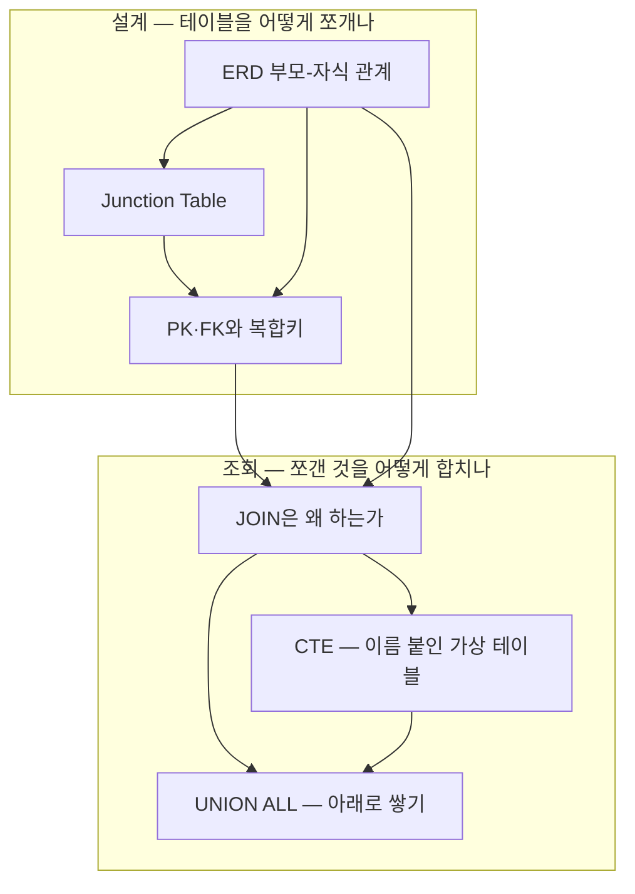

# 00 학습 지도 — DB 설계와 SQL

RE:SEED 프로젝트(탄소 배출량 산정)의 산정 근거 ↔ 증빙 파일 테이블을 설계하며 학습한 내용의 지도.
2026-08-26 정리.

## 노트 관계도

## 읽는 순서 (추천)

### 1부 — 설계: 쪼개기

1. [[ERD 부모-자식 관계]] — "부모가 삭제되면 자식이 의미를 잃는가?"(존재 종속성). 식별/비식별, 관계 유형 3종
2. [[Junction Table — 다대다를 두 개의 1대N으로]] — N:M을 두 개의 1:N으로 분해하는 다리 테이블. 관계 자체의 정보를 담는 자리
3. [[PK·FK와 복합키]] — PK는 하나지만 여러 컬럼의 조합일 수 있다. FK는 Unique 컬럼만 참조 가능

### 2부 — 조회: 합치기

4. [[JOIN은 왜 하는가]] — 쪼개서 저장하고 합쳐서 본다. 필요할 때만 JOIN하는 네 가지 레벨
5. [[CTE — 이름 붙인 가상 테이블]] — 미리 줄여놓고 JOIN한다. VIEW와의 차이
6. [[UNION ALL — 아래로 쌓기]] — 관계 없이 규격만 맞으면 세로로. 기준은 컬럼명이 아니라 순서

## 전체를 관통하는 문장

> **저장은 쪼개서(정규화), 조회는 합쳐서(JOIN·CTE·UNION).**
> 쪼갤 때의 질문은 "부모가 사라지면 자식이 의미를 잃는가"이고,
> 합칠 때의 질문은 "옆으로 붙일 관계(PK-FK)인가, 아래로 쌓을 규격인가"이다.
