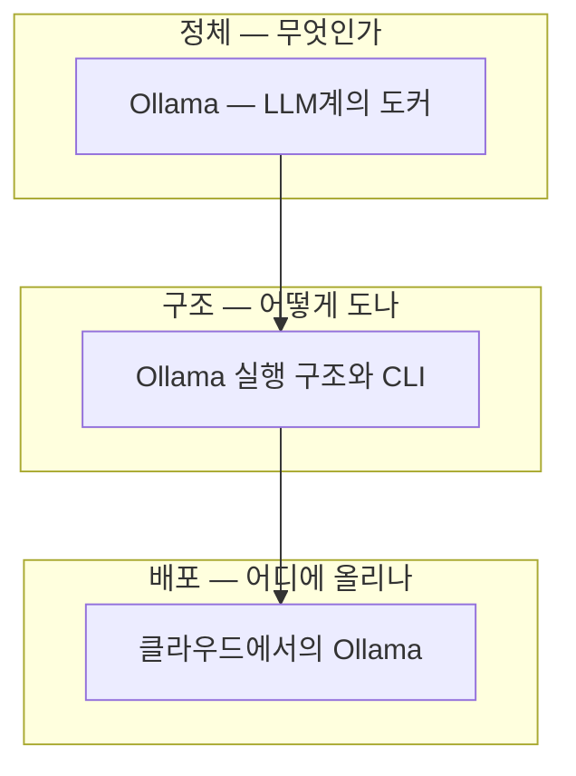

# 00 학습 지도 — LLM 서빙과 Ollama

로컬 LLM 서빙 도구 Ollama의 정체·실행 구조·클라우드 배포를 학습한 지도.
2026-08-27 정리.

## 노트 관계도

## 읽는 순서 (추천)

1. [[Ollama — LLM계의 도커]] — 서빙 + 모델 허브 + 경량화(4비트 양자화 GGUF)의 결합. 허깅페이스(도매시장) vs Ollama(밀키트)
2. [[Ollama 실행 구조와 CLI]] — 클라이언트-서버 구조. `/exit`해도 서버는 살아 있고, 5분 유휴 시 모델만 언로드
3. [[클라우드에서의 Ollama]] — S3는 실행이 아니라 창고. EC2+EBS 또는 Docker+ECS/EKS, 보안 그룹과 ALB

## 전체를 관통하는 문장

> **Ollama는 모델 저장소가 아니라 런타임이다 — 허깅페이스의 재료를 밀키트로 만들어 11434 포트에 차려준다.**
> 로컬이든 AWS든 실행 공식은 같다: 빠른 디스크에서 VRAM으로 올려 서빙하고, S3 같은 느린 창고는 원본 보관용이다.

## 추후 확인

- [ ] 올라마 서버를 내리는 CLI (`ollama stop` 등) — 대화 내보내기가 답변 전에 끊겨 미기록
