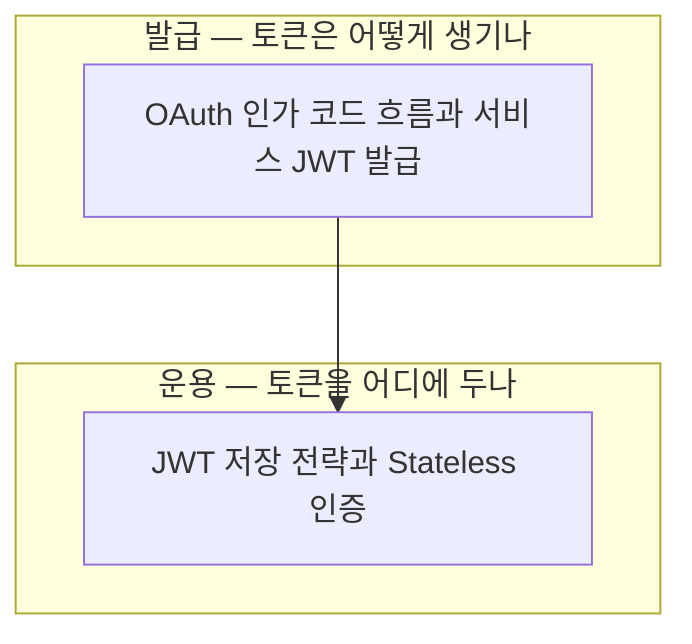

# 00 학습 지도 — OAuth와 JWT

사이드 프로젝트(Spring Boot + Next.js)에 카카오 소셜 로그인을 붙이며 학습한 내용의 지도.
2026-08-26 정리.

## 노트 관계도

## 읽는 순서 (추천)

1. [[OAuth 인가 코드 흐름과 서비스 JWT 발급]] — 인가 코드 → 카카오 토큰 → 사용자 정보 → 서비스 JWT의 3단 교환. 카카오 설정 키 4종과 Secret Key 직접 생성
2. [[JWT 저장 전략과 Stateless 인증]] — Access는 메모리, Refresh는 HttpOnly 쿠키 + Redis 장부. Silent Refresh와 Kill Switch

## 전체를 관통하는 문장

> **카카오는 "이 사람이 카카오 유저가 맞다"까지만 보증하고, 우리 서비스의 신분증(JWT)은 백엔드가 직접 만든다.**
> 발급 후 서버는 서명 "판독"만 하고(Stateless), 로그아웃 같은 "통제"는 Refresh Token 장부 하나로 해결한다.
