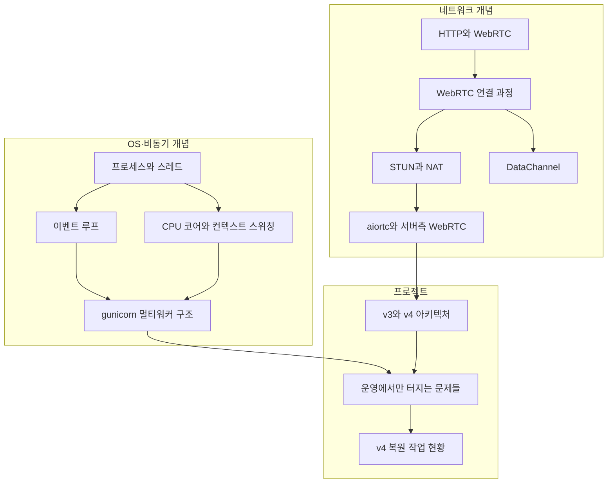

# 00 학습 지도 — 음성채팅과 네트워크·OS

v3/v4 음성채팅 시스템의 롤백 원인을 추적하며 학습한 내용의 전체 지도.
2026-08-06 정리.

## 노트 관계도

## 읽는 순서 (추천)

### 1부 — 네트워크: 음성은 어떻게 흐르나

1. [[HTTP와 WebRTC]] — 내가 알던 HTTP와 뭐가 다른가. 3채널 구조
2. [[WebRTC 연결 과정]] — 버튼 클릭부터 통화까지 6단계 (SDP=명함, ICE=길 뚫기)
3. [[STUN과 NAT]] — 인터넷의 거울. host/srflx/relay 후보의 정체
4. [[DataChannel]] — 음성용 UDP 구멍에 얹은 메시지 통로 (브라우저 내장)
5. [[aiortc와 서버측 WebRTC]] — 파이썬이 WebRTC 참여자가 되는 비용. 5초 문제

### 2부 — OS·비동기: 서버는 어떻게 일하나

6. [[프로세스와 스레드]] — 공장과 일꾼. "워커"라는 말의 세 가지 뜻
7. [[CPU 코어와 컨텍스트 스위칭]] — 동시 실행 수는 CPU가, 생성 가능 수는 RAM이 정한다
8. [[이벤트 루프]] — 분배자가 아니라 직접 실행하는 무한 루프. 아무도 안 여는 우편함
9. [[gunicorn 멀티워커 구조]] — 마스터/워커, import는 실행이다, 워커끼리는 서로를 모른다

### 3부 — 프로젝트: 개념이 실전에서 터진 기록

10. [[v3와 v4 아키텍처]] — v3는 안 만져서 튼튼했고, v4는 만지려다 무너졌다
11. [[운영에서만 터지는 문제들]] — 로그 폭탄·좀비 세션·event loop 불일치·유실된 수정 2건
12. [[v4 복원 작업 현황]] — 완료된 것과 남은 것, 담당 과제와의 연결

## 전체를 관통하는 문장

> **v3는 서버가 오디오를 안 만져서 튼튼했고, v4는 만지려다 무너졌다.**
> 그리고 무너진 문제들은 전부 dev가 재현하지 못하는 것들이었다 —
> 트래픽 양(로그 폭탄), 실사용자 행동(좀비 세션), 프로세스 구조(event loop).
