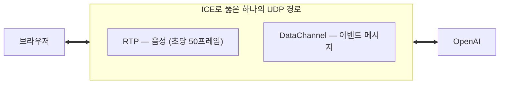

# DataChannel

> [!summary] 한 줄 요약
> DataChannel은 **브라우저에 내장된** `RTCPeerConnection` API의 일부로, 음성용으로 이미 뚫어놓은 UDP 구멍 위에 얹어 쓰는 양방향 메시지 통로다. 별도 라이브러리도, 별도 연결도 필요 없다.

## 브라우저 내장이다

```js
this.dataChannel = this.pc.createDataChannel('oai-events', { ordered: true });
```

이 한 줄이면 끝. `'oai-events'`는 그냥 이름표고, OpenAI가 그 이름으로 약속해둔 것이다.

`{ ordered: true }`는 "순서를 보장하라"는 뜻 — DataChannel은 신뢰성을 **선택**할 수 있다. 끄면 순서 무시하고 빠르게 보낸다. 이벤트 메시지는 순서가 중요하니 켠 것이다.

## WebSocket과 헷갈리기 쉬운데 다르다

| | WebSocket | DataChannel |
|---|---|---|
| 기반 | TCP | **SCTP over DTLS over UDP** |
| 연결 대상 | 서버 | **피어(상대방)** |
| 신뢰성 | 항상 보장 | **선택 가능** (`ordered` 옵션) |
| 경로 | 서버 경유 | 미디어와 **같은 경로** |

핵심은 마지막 줄 — **미디어와 같은 UDP 연결 위에 얹혀 간다.** [[WebRTC 연결 과정]]에서 ICE로 뚫어놓은 구멍을 재활용하므로, 별도 연결·인증·NAT 통과가 필요 없다.



## HTTP와 결정적으로 다른 점

HTTP는 클라이언트가 물어야만 서버가 답한다. DataChannel은 **상대가 먼저 말을 건다.** AI가 답변을 시작하는 순간을 브라우저에 알릴 수 있는 이유다 ([[HTTP와 WebRTC]]).

## 여기로 오가는 것들

```
response.audio_transcript.delta          AI 답변 자막
conversation.item...transcription        내 발화 인식 결과
response.function_call_arguments.done    "RAG 검색해줘" (tool 호출)
```

마지막 것이 RAG 흐름의 시작이다 — OpenAI가 DataChannel로 검색을 요청하면, 브라우저가 심부름꾼이 되어 우리 서버에 HTTP로 물어보고 결과를 되돌려준다 ([[WebRTC 연결 과정]] 6단계).

## v3든 v4든 똑같다

[[v3와 v4 아키텍처]]에서 바뀌는 건 미디어 경로 하나뿐이다. 시그널링(HTTP)과 DataChannel은 양쪽 버전에서 동일하게 동작한다.

## 관련 노트

- 3채널 구조 전체 → [[HTTP와 WebRTC]]
- 이 통로가 뚫리는 과정 → [[WebRTC 연결 과정]]
