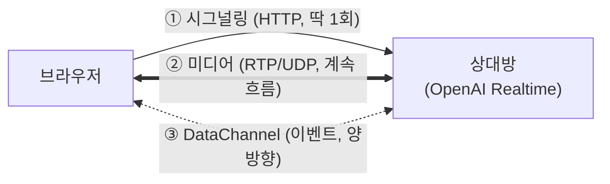

# HTTP와 WebRTC

> [!summary] 한 줄 요약
> HTTP는 "한 번 묻고 한 번 답하는" 방식이라 실시간 음성에 맞지 않는다. 그래서 WebRTC는 **연결 주선에만 HTTP를 쓰고**, 실제 음성은 UDP 기반의 별도 채널로 흘려보낸다.

## HTTP — 내가 알고 있던 통신 방식

버튼을 누르면 브라우저가 서버에 요청을 보내고, 서버가 응답을 돌려주는 구조.

```
[브라우저] ──── 요청 ────> [서버]
[브라우저] <─── 응답 ───── [서버]
              (끝. 연결 종료)
```

이 방식은 문서·데이터 조회에는 완벽하지만, **실시간 음성 통화에는 세 가지 치명적 한계**가 있다.

| 문제 | 이유 |
|---|---|
| **서버가 먼저 말을 못 건다** | 클라이언트가 물어야만 답할 수 있다. AI가 답변을 시작해도 알릴 방법이 없다 |
| **느리다** | 요청마다 TCP 연결·헤더 왕복이 붙는다. 실시간 대화엔 치명적 |
| **TCP가 오히려 방해** | 패킷 하나 유실되면 재전송을 기다리며 뒤 패킷이 전부 밀린다(head-of-line blocking) |

음성은 **조금 끊기더라도 계속 흐르는 게** 낫다. 그래서 유실을 재전송하지 않고 그냥 넘어가는 **UDP**가 음성엔 정답이다.

## WebRTC — 채널이 3개다

WebRTC는 하나의 연결이 아니라 **세 개의 채널이 동시에 도는** 구조다.



| 채널 | 프로토콜 | 역할 |
|---|---|---|
| ① 시그널링 | **HTTP** | 연결 주선. 명함(SDP) 교환 딱 1회 |
| ② 미디어 | RTP over **UDP** | 실제 음성. 20ms 조각이 초당 50개씩 양방향으로 계속 흐름 |
| ③ DataChannel | SCTP over UDP | 이벤트·제어 메시지. 서버가 먼저 말을 걸 수 있는 양방향 통로 |

**①번만 내가 알던 그 HTTP다.** ②③은 완전히 다른 프로토콜이고, 요청/응답 개념 없이 그냥 계속 흘러간다.

그래서 서버 로그에 요청이 안 남는데도 통화는 잘 되는 것이다 — 통화 중에는 HTTP가 아예 없으니까.

## 프로젝트에서의 의미

우리 음성채팅에서 HTTP가 쓰이는 곳은 딱 두 군데다.

1. **연결 주선** — `POST /agent/session`으로 SDP를 한 번 교환 ([[WebRTC 연결 과정]] 3단계)
2. **RAG 검색** — 통화 중 OpenAI가 검색을 요청하면 브라우저가 우리 서버에 HTTP로 물어봄

나머지 음성·이벤트는 전부 ②③ 채널로 흐른다. v3와 v4의 차이는 이 중 **②번 미디어 경로에 우리 서버가 끼느냐 마느냐**다 → [[v3와 v4 아키텍처]]

## 관련 노트

- 연결이 실제로 맺어지는 과정 → [[WebRTC 연결 과정]]
- ③번 채널의 정체 → [[DataChannel]]
- 파이썬 서버가 이 채널의 참여자가 되면 → [[aiortc와 서버측 WebRTC]]
