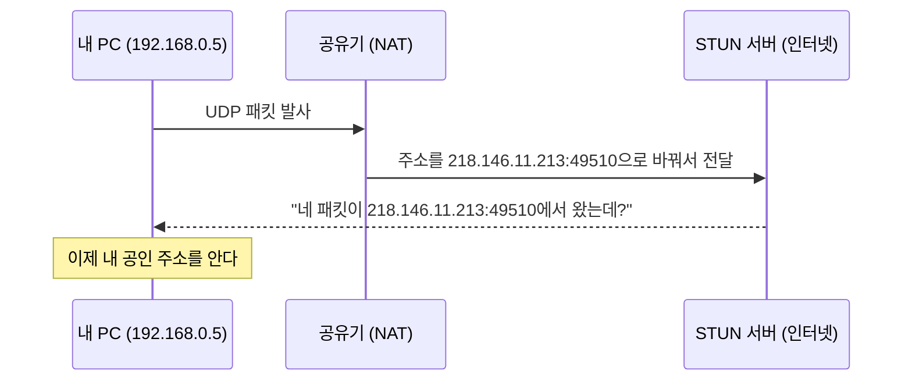

# STUN과 NAT

> [!summary] 한 줄 요약
> STUN은 **인터넷에 떠 있는 거울**이다 — "밖에서 본 네 주소는 이거야"를 알려준다. NAT 뒤의 기기는 자기 공인 주소를 모르기 때문에 필요하고, 공인 IP를 직접 문 서버에게는 아무 정보도 주지 않는다.

## NAT — 왜 내 주소를 내가 모르나

내 PC는 자기 주소를 `192.168.0.5`로만 안다. 공유기 뒤의 **사설 주소**라 외부에서 이 주소로는 못 찾아온다. 공유기가 NAT로 주소를 바꿔서 내보내는데, **바뀐 주소가 뭔지는 나가본 놈만 안다.**

## STUN — 인터넷의 거울

STUN은 **인터넷 어딘가에 떠 있는 별도의 공개 서버**다. 우리 시스템은 구글이 무료로 운영하는 것을 쓴다:

```
stun:stun.l.google.com:19302
```

프론트(`webrtc_voice_module.js`)와 백엔드 aiortc **양쪽 다 이 주소**를 쓴다(aiortc는 설정을 안 넘기면 기본값으로 이걸 쓴다).

하는 일은 딱 하나다:



"일단 밖에 한 번 나가보고, 밖에서 내가 어떻게 보이는지 물어보는" 것. 거울 같은 거다.

중요한 특성:

- **음성은 STUN을 지나가지 않는다.** 연결 수립 때 주소 확인용으로 몇 패킷만 오간다
- 그래서 구글이 무료로 열어둘 수 있다 — 대역폭을 거의 안 쓴다
- 반면 **TURN은 미디어를 통째로 중계**하므로 대역폭 비용이 든다. 공개 무료 TURN이 거의 없는 이유

## 후보(candidate) 3종의 정체

[[WebRTC 연결 과정]]의 SDP에 적히는 `typ`이 이것이다:

| 후보 | 뜻 | 출처 |
|---|---|---|
| `typ host` | 내가 아는 내 주소 (192.168.0.5) | 내 네트워크 인터페이스 |
| `typ srflx` | STUN이 알려준 주소 (218.146.11.213) | **s**erver **r**e**fl**e**x**ive — 거울에 비친 나 |
| `typ relay` | TURN 중계 주소 | 우리 시스템엔 없음 |

ICE는 양쪽의 이 후보들을 **모든 조합으로 시험**해서 통하는 길을 채택한다.

## 프로젝트에서 겪은 두 가지

### ① 기각된 가설 — "TURN이 없어서 모바일이 안 된다"

v4 롤백 조사 초기에 세운 가설이었지만, **갤럭시 4G 실측에서 정상 연결**되며 기각됐다. 선택된 경로는 srflx ↔ host 조합이었다 — 캐리어 NAT도 STUN만으로 뚫렸다.

### ② 공인 IP 서버에게 STUN은 무의미하다 — 5초 문제의 해결

dev 서버는 공인 IP(110.45.147.56)를 **직접** 물고 있다. NAT 뒤가 아니다. 그러면:

```
host 후보  = 110.45.147.56  (내가 아는 내 주소)
srflx 후보 = 110.45.147.56  (STUN이 알려줄 주소)  ← 같은 값!
```

거울은 "밖에서 본 내 주소"를 알려주는 건데, **밖에서 본 주소와 안에서 아는 주소가 같은 서버**에게는 아무 정보도 주지 않는다. 이미 아는 답을 확인하려고 세션마다 5초를 쓰고 있던 셈이다.

그래서 서버 쪽 aiortc에 `iceServers=[]`로 STUN을 끄니 **5,004ms → 6ms**가 됐고, host 후보는 그대로라 연결성 손실이 없었다. 모바일 실측에서도 선택된 경로가 "서버의 host 후보"였으니, srflx 10개는 만들어놓고 쓰이지도 않았던 것이다. 자세한 맥락은 [[aiortc와 서버측 WebRTC]].

## 관련 노트

- 후보가 SDP에 실려 교환되는 과정 → [[WebRTC 연결 과정]]
- 서버가 후보를 수집하다 5초를 태운 사연 → [[aiortc와 서버측 WebRTC]]
