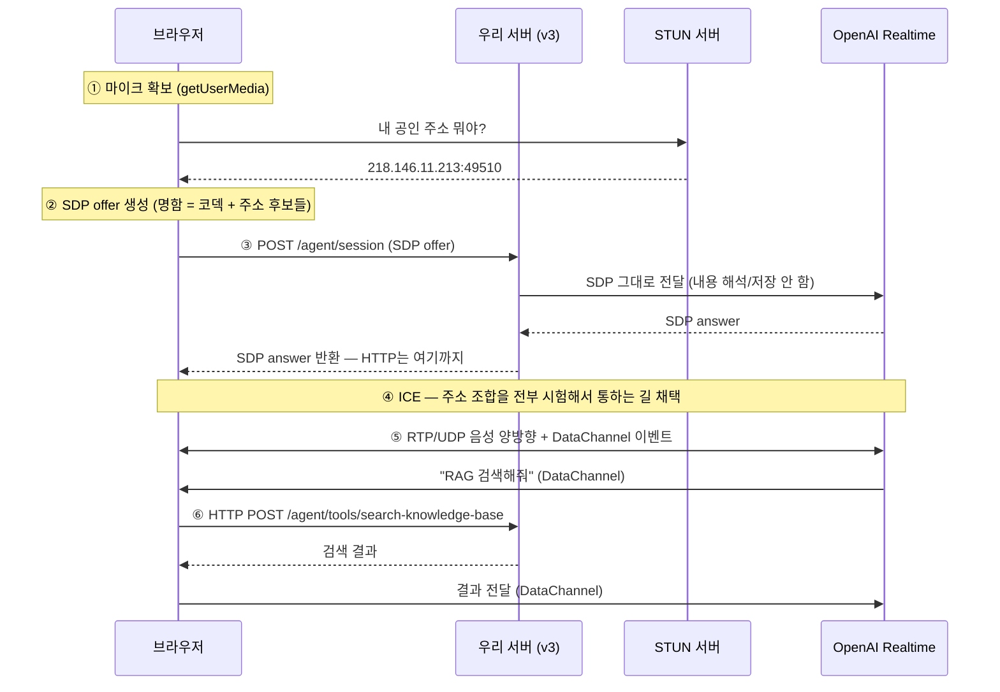

# WebRTC 연결 과정

> [!summary] 한 줄 요약
> [음성] 버튼을 누른 순간부터 통화까지는 6단계다: **마이크 확보 → 명함(SDP) 만들기 → HTTP로 명함 교환 → ICE로 실제 길 뚫기 → 통화 → 필요할 때만 다시 HTTP(RAG)**.

## 전체 흐름 한눈에



## 1단계 — 마이크 확보 (네트워크 없음)

```js
navigator.mediaDevices.getUserMedia({ audio: {...} })
```

권한 팝업이 뜨고, 허용하면 마이크 스트림을 얻는다. 아직 브라우저 내부 일이다.

## 2단계 — 명함 만들기: SDP

```js
const pc = new RTCPeerConnection({ iceServers: [...] });
pc.addTrack(track, stream);
const offer = await pc.createOffer();
```

**SDP(Session Description Protocol)는 "나는 이런 놈이다"를 적은 텍스트 명함**이다.

```
v=0
m=audio 9 UDP/TLS/RTP/SAVPF 111      ← 오디오, 이 포맷으로
a=rtpmap:111 opus/48000/2            ← Opus 코덱, 48kHz
a=candidate:1 1 udp 2122 192.168.0.5 54321 typ host    ← 내 주소들
a=candidate:2 1 udp 1686 218.146.11.213 49510 typ srflx
a=fingerprint:sha-256 ...            ← 암호화 지문
```

`candidate` 줄이 핵심이다 — **"나한테 연락하려면 이 주소들 중 하나로 와라"**는 후보 목록. 후보가 뭔지, `host`/`srflx`가 뭔지는 [[STUN과 NAT]] 참조.

## 3단계 — 명함 교환: 여기서만 HTTP를 쓴다

```
POST /AI_voice/voice-chat-v3/agent/session
{ "sdp": "v=0\r\no=- ...", "model": "gpt-realtime-2" }
  ↓ 응답
{ "sdp_answer": "v=0\r\no=- ...", "model": "gpt-realtime-2" }
```

**평범한 HTTP POST 한 번이다.** v3에서 우리 서버는 이 SDP를 받아 OpenAI에 그대로 넘기고, 답을 되돌려줄 뿐 — 내용을 해석하지도 저장하지도 않는다. 그래서 v3 서버는 WebRTC 참여자가 아니다 ([[v3와 v4 아키텍처]]).

## 4단계 — 실제 연결 뚫기: ICE

명함을 교환했으니 양쪽이 서로의 주소 **목록**은 안다. 하지만 **어느 주소가 실제로 통하는지는 모른다.**

```
내 후보:      host(192.168.0.5) / srflx(218.146.11.213)
상대 후보:    host(110.45.147.56) / …
→ 모든 조합에 STUN 요청을 쏴보고, 응답이 오는 조합을 채택
```

모바일 실측 로그에 찍힌 게 이 과정이다:

```
ICE 연결 상태 → checking     (조합 시험 중)
ICE 연결 상태 → connected    (성공)
선택된 경로: 내 srflx ↔ 상대 host (udp)
```

이 짓이 필요한 이유는 대부분의 기기가 **NAT(공유기) 뒤에** 있어 자기 공인 주소를 모르기 때문 → [[STUN과 NAT]].

ICE 연결 상태는 통화 중에도 계속 변한다(`connected → disconnected → failed`). 이 상태 전이가 좀비 세션 문제의 핵심이다 → [[운영에서만 터지는 문제들]].

## 5단계 — 통화: HTTP는 이제 없다

```
[브라우저] ══════ RTP/UDP (Opus 음성) ══════> [OpenAI]
           <═════ RTP/UDP (합성 음성) ═══════
           <───── DataChannel (이벤트) ─────>
```

- **미디어** — 20ms짜리 오디오 조각이 초당 50개씩 양방향으로 흐른다. 요청/응답 개념이 없다.
- **DataChannel** — `oai-events` 이름의 양방향 메시지 통로. HTTP와 달리 **상대(OpenAI)가 먼저 말을 건다** → [[DataChannel]]

## 6단계 — RAG가 필요할 때만 다시 HTTP

```
[OpenAI] ──DataChannel──> [브라우저] ──HTTP POST──> [우리 서버]
         "검색해줘"                                   벡터 검색
         <──DataChannel─── [브라우저] <──HTTP 응답──
         "결과 여기 있음"
```

**브라우저가 심부름꾼**이다. OpenAI가 시키면 우리 서버에 HTTP로 물어보고, 답을 다시 OpenAI에 전달한다.

## 시간 감각

```
버튼 클릭
  ├─ [HTTP] 명함 교환 ──── 딱 1회
  ├─ [ICE]  길 뚫기 ────── 1~13초
  └─ 연결 후: RTP + DataChannel ── 통화 내내
```

v4에서 이 ICE 단계가 서버 쪽에서도 일어나면서 5초 문제가 생겼다 → [[aiortc와 서버측 WebRTC]]

## 관련 노트

- 왜 채널이 3개인가 → [[HTTP와 WebRTC]]
- 후보(candidate)와 NAT 통과 → [[STUN과 NAT]]
- 이벤트 통로의 정체 → [[DataChannel]]
