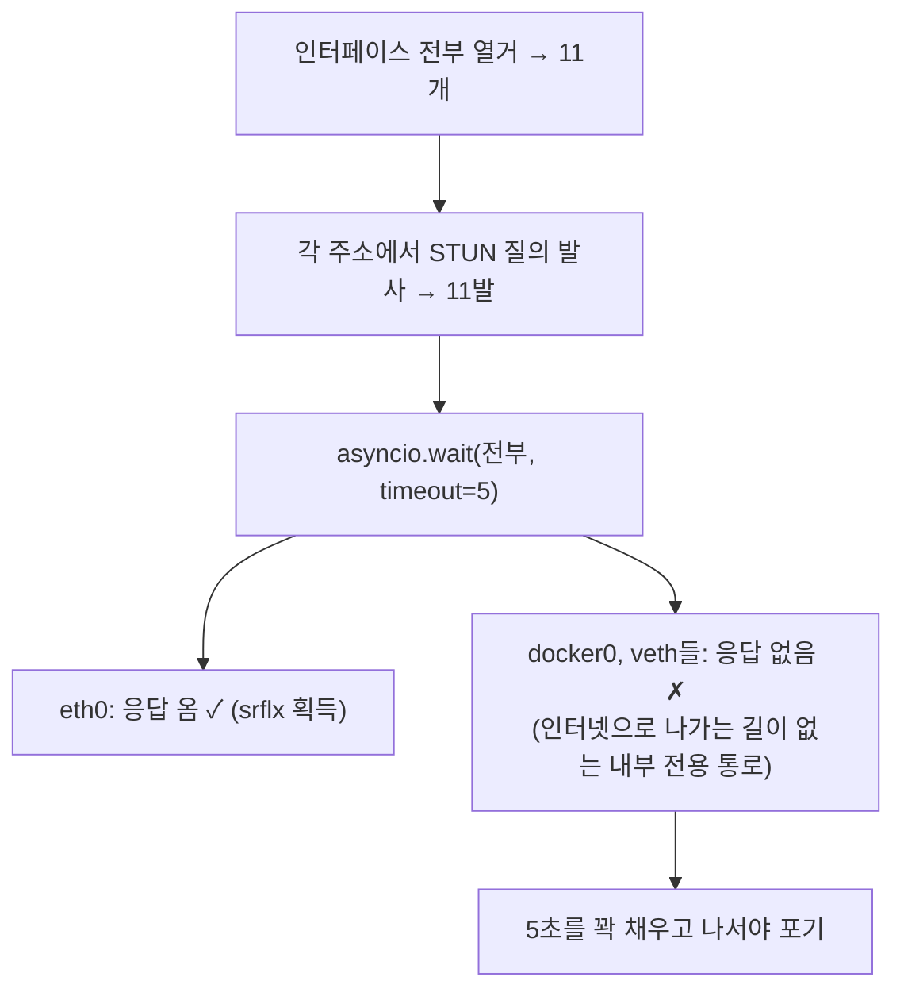

# aiortc와 서버측 WebRTC

> [!summary] 한 줄 요약
> aiortc는 **파이썬을 WebRTC 참여자로 만들어주는 라이브러리**다. 브라우저의 `RTCPeerConnection`을 파이썬으로 구현한 것 — 그리고 참여자가 되는 순간 서버도 ICE 후보 수집 비용을 치러야 한다. 그것이 v4의 5초 문제였다.

## 어디서 쓰이나

브라우저에는 `RTCPeerConnection`이 내장돼 있지만 파이썬엔 없다. aiortc가 그 역할을 한다.

**사용 지점은 `server_webrtc.py` 딱 하나 — 그리고 v3에서는 전혀 안 쓰인다.**

```
v3:  [브라우저] ═══════ 오디오 ═══════> [OpenAI]
     우리 서버는 SDP 문자열만 중계 → aiortc 불필요

v4:  [브라우저] ══ 오디오 ══> [우리 서버] ══ 오디오 ══> [OpenAI]
                              ↑ 여기가 aiortc
```

v4에서 서버는 **PeerConnection을 2개** 만든다:

```python
# server_webrtc.py 안의 두 지점
pc = _build_pc()   # ① 브라우저를 상대하는 연결  (create_answer)
pc = _build_pc()   # ② OpenAI를 상대하는 연결   (_connect_realtime)
```

서버가 **중간에 낀 두 통화의 참여자**가 되는 것이다. 그래서 오디오 프레임을 실제로 손에 쥘 수 있고, 소음 필터를 끼울 수 있다:

```python
relay_track = self._input_relay.subscribe(track)
relay_track = NoiseFilteredAudioProxyTrackV4(relay_track, ...)  # 여기서 필터
pc.addTrack(relay_track)
```

## 참여자가 되는 비용 — ICE 5초 문제

WebRTC 참여자는 자기 ICE 후보를 수집해야 한다([[WebRTC 연결 과정]] 4단계). 브라우저가 하던 그 일을 서버도 하게 된다.

그런데 dev 서버에는 **네트워크 인터페이스가 11개** 있었다. 서버가 11대라는 뜻이 아니라, **한 대에 달린 네트워크 출입구가 11개**라는 뜻이다:

```
eth0      110.45.147.56    ← 물리 랜카드 (진짜 인터넷 연결)
docker0   172.17.0.1       ← 도커가 만든 가상 브리지
veth1a2b  ...              ← 도커 컨테이너 1개당 하나씩 생기는 가상 통로
veth3c4d  ...
br-xxxx   ...              ← docker-compose 네트워크용 브리지
```

aioice(aiortc의 ICE 담당)는 후보를 모을 때:



측정하니 **매번 5,042~5,066ms, 편차 20ms 이내** — 지연이 아니라 **타임아웃 상수**를 매번 정직하게 다 기다린 것이다. 진단 결과 `host=11, srflx=10`도 이를 말해준다: 11개 중 10개만 STUN 응답을 받았다, 즉 최소 1개는 막다른 골목이었다.

## 앱 전체가 멈추는 것으로 이어진다

aiortc는 이 시간 동안 블록되므로 **그 요청을 처리하던 프로세스가 통째로 묶인다** ([[gunicorn 멀티워커 구조]]).

dev Chat App 은 uvicorn 단독 실행이라 **프로세스 1개, 이벤트 루프 1개**다(2026-08-13 실측). 그 하나뿐인 루프가 5초씩 멈춘다.

```
세션 1건 = 최대 10초 (브라우저측 + OpenAI측)
→ dev 는 세션 한두 건만으로 앱 전체가 응답 불능
```

이건 이론이 아니다 — 진단 중 실제로 dev 서버가 멈췄고, `kss_app.service` 재시작으로 복구했다.

> [!note] 2026-08-13 정정
> 원래 "워커 4개 × 세션당 5초 → 동시 4명이면 응답 불능"이라고 적었으나 사실이 아니다. dev 에는 워커가 없고, 이 서버의 다른 gunicorn 들도 `--workers 2` 다. **워커가 여러 개였다면 오히려 더 버텼을 상황**이라 원인은 더 단순하다 — 프로세스가 하나뿐이었다. 운영 워커 수는 미확인.

## 해결 — STUN을 끈다

이 서버는 공인 IP를 직접 물고 있어 STUN이 알려줄 정보가 없다([[STUN과 NAT]]). `iceServers=[]`로 끄니:

```
5,004ms → 6ms
```

host 후보는 그대로라 연결성 손실도 없었다. 이 수정(`fix/v4-ice-gathering-latency`)이 v4 복원의 **선행 조건**이다 → [[v4 복원 작업 현황]]

## 남은 비용

5초를 없앴어도 v4는 세션당 PeerConnection 2개를 쓴다. 동시 몇 세션까지 견디는지는 **미측정**이다 — 활성화 후 부하 측정이 필요하다.

측정할 때 주의할 점이 있다. **dev 와 운영은 구조가 다르다.** dev 는 uvicorn 단독(프로세스 1개)이고 운영은 gunicorn 멀티워커라, dev 에서 잰 값을 운영에 그대로 대입할 수 없다. 운영 워커 수도 아직 확인되지 않았다.

## 관련 노트

- v3가 이 비용이 0인 이유 → [[v3와 v4 아키텍처]]
- STUN이 왜 무의미했나 → [[STUN과 NAT]]
- 워커가 묶인다는 것의 의미 → [[gunicorn 멀티워커 구조]]
