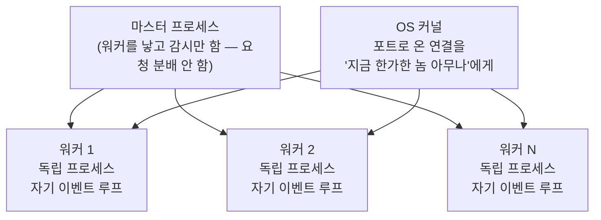
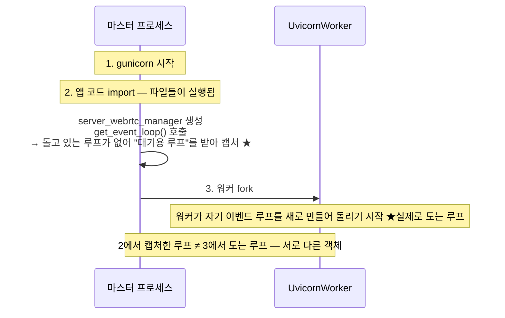

# gunicorn 멀티워커 구조

> [!summary] 한 줄 요약
> gunicorn은 마스터가 워커 **프로세스** 4개를 fork하고, 요청은 **OS 커널이** 한가한 워커에게 던진다 — 작업을 배정하는 관리자는 없다. 워커끼리는 메모리를 공유하지 않고, 각자 자기 이벤트 루프를 돌린다. dev(단일 프로세스)와 운영(멀티워커)의 차이가 여기서 갈린다.

## 구조

> [!warning] 2026-08-13 정정 — "워커 4개"는 근거가 없었다
> 서버에서 직접 확인한 결과 아래 셋이 드러났다. 이 노트를 포함해 여러 노트가 "워커 4개"를 전제로 쓰여 있으니 그 숫자는 무시할 것.
>
> - **dev Chat App(9010)은 gunicorn 이 아니다.** `kss_app.service` 의 `ExecStart` 가 `uvicorn app:app` 을 단독 실행한다. 워커 개념 자체가 없고 프로세스 1개, 이벤트 루프 1개다.
> - **이 서버에서 도는 다른 gunicorn 들은 전부 `--workers 2`** 다(명령줄에서 직접 지정). 4는 어디에도 없다.
> - **`APP_WORKERS = 4` 는 `config.example.py` 의 기본값일 뿐** 구동에 쓰이지 않는다. 게다가 `gunicorn.conf.py` 는 `worker = ...` 로 **단수**라 gunicorn 이 인식하지 못한다(설정 이름은 `workers`). 지금은 명령줄 인자가 우선하므로 무해하지만, 그 인자를 빼는 순간 워커 1개가 된다.
>
> **운영 Chat App 의 실제 워커 수는 아직 미확인이다.** 아래 설명의 구조와 함정은 그대로 유효하고, 숫자만 "N개"로 읽으면 된다.



- **분배자는 없다.** 마스터는 "이 작업은 워커2 담당" 같은 배정을 하지 않는다. 워커들이 같은 포트를 다같이 듣고 있고, **먼저 집는 놈이 임자**다.
- 각 워커는 **독립된 프로세스**다 — [[프로세스와 스레드]]의 규칙대로 메모리를 공유하지 않는다.
- 각 워커가 **자기만의 이벤트 루프**를 만들어, 자기가 받은 요청들을 자기 루프에서 동시 처리한다 ([[이벤트 루프]]).
- 워커 수는 보통 코어 수에 맞춰 정한다 ([[CPU 코어와 컨텍스트 스위칭]]). 다만 **우리 서버가 그렇게 정해져 있다는 근거는 없다** — 위 정정 참고.

```
dev:   uvicorn 단독 실행         → 프로세스 1개, 이벤트 루프 1개  (실측 확인)
운영:  gunicorn + UvicornWorker  → 마스터 1개 + 워커 N개, 루프 N개  (N 미확인)
```

## 함정 ① — "import는 파일을 실행하는 것"이다

파이썬의 import는 선언을 읽어들이는 게 아니라 **그 파일을 위에서 아래로 통째로 실행하는 것**이다.

```python
# server_webrtc.py
import asyncio                          # ← 실행됨

class ServerWebRTCSessionManager:       # ← 클래스 정의가 실행됨
    def __init__(self):
        self._loop = asyncio.get_event_loop()

server_webrtc_manager = ServerWebRTCSessionManager()   # ← ★ 이 줄도 실행됨!
```

마지막 줄은 클래스 밖, 파일 맨 바닥의 **모듈 레벨 코드**다. 누가 이 파일을 import하는 순간 객체가 그 자리에서 생성되고, `__init__`이 돌고, `get_event_loop()`가 호출된다.

## 함정 ② — import 시점의 루프 ≠ 실행 시점의 루프

시간 순서로 보면:



2번에서 잡은 루프는 **아무도 돌리지 않는 마스터의 idle 루프**다. 나중에 요청이 들어와 `self._loop.create_task(...)`를 하면, 그 죽은 루프의 큐에 태스크가 얹히고 — 끝. 아무도 그 큐를 꺼내지 않는다. [[이벤트 루프]]의 "아무도 안 여는 우편함"이 바로 이것이다.

**dev에서 안 보인 이유**: uvicorn 단일 프로세스에서는 import 시점 루프와 실행 루프가 우연히 **같은 것**이니까. 실제 버그 증상과 수정은 [[운영에서만 터지는 문제들]] 참조.

## 함정 ③ — 워커끼리는 서로를 모른다

세션 상태를 워커의 메모리에 들고 있으면:

```
요청 A: 세션 생성 → 워커2가 받음
        워커2의 메모리에 _pcs["abc123"] = PeerConnection 저장

요청 B: 같은 세션 정리(/release) → 커널이 워커4에게 줌
        워커4: "abc123? 그런 세션 모르는데?" → 404
```

v4의 세션 상태(`_pcs` 딕셔너리)는 **그 세션을 만든 워커의 메모리에만** 존재한다. WebRTC 미디어 자체는 괜찮다 — 한번 뚫린 UDP 연결은 그 워커 프로세스에 계속 붙어 있다. 문제는 **세션을 참조하는 별도 HTTP 호출들**(release, 통계 업로드 등)이 다른 워커에 떨어질 수 있다는 것. v4를 실제로 켜기 전에 검증해야 할 잠재 이슈다 ([[v4 복원 작업 현황]]의 남은 위험).

## 공통 교훈

세 함정 모두 **워커가 1개면 존재하지 않는 문제**다. dev에서 완벽하게 돌던 코드가 운영에서만 무너진 구조적 이유가 여기 있다.

## 관련 노트

- 루프가 "돌아야만 도는" 코드라는 것 → [[이벤트 루프]]
- 프로세스 간 메모리 비공유 → [[프로세스와 스레드]]
- 이 함정들이 실제로 터진 기록 → [[운영에서만 터지는 문제들]]
