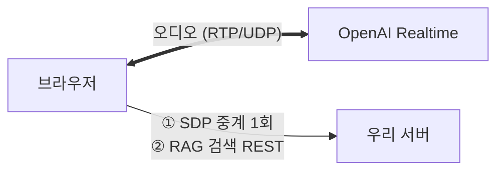
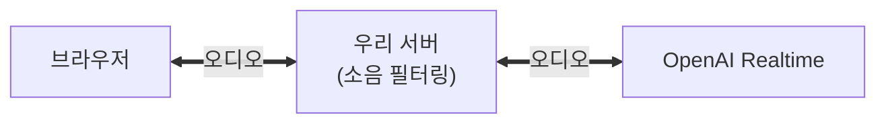

# v3와 v4 아키텍처

> [!summary] 한 줄 요약
> **v3는 서버가 오디오를 안 만져서 튼튼했고, v4는 만지려다 무너졌다.** v4는 소음 필터·끼어들기를 위해 서버를 오디오 경로에 끼워 넣었는데, 그 대가(ICE 5초·워커 점유)와 v3 오염, 운영 부담이 겹쳐 2026-07-13 롤백됐다.

## v3 — 서버가 오디오를 안 만지는 구조 (브릿지리스)



서버가 하는 일은 연결 주선(SDP 1회 중계)과 RAG 검색 응답뿐이다. 통화 중에는 아무것도 안 하니 부하도 없고 장애 지점도 없다 — **단순해서 튼튼하다.** 모바일에서 잘 되는 이유이기도 하다.

**그런데 그 단순함이 곧 한계다.** 서버가 오디오를 못 보니 **소음을 걸러낼 방법이 없다.** 주변 잡음에 AI가 반응하거나, 사용자가 말을 끊고 들어가도(barge-in) 처리할 수 없다.

## v4 — 서버를 오디오 경로에 끼워 넣은 구조 (서버 브릿지)



v4가 추가하려 한 것:

| 기능 | 내용 |
|---|---|
| 소음/짧은발화 필터 | 1초 이하 잡음 무시, 발화 비율 30% 미만 차단 |
| 끼어들기(barge-in) | 1초 이상 실발화 감지 시 AI 응답 중단 |
| 토큰 사용량 반환 | 과금 추적 |
| 세션 수명주기 관리 | session_id, release |

담당 과제인 **"시간 옵션 0.1~3초"가 바로 이 필터의 파라미터**(`min_utterance_duration_ms`, `barge_in_ms`)다. v4 없이는 그 과제도 불가능하다.

바뀌는 건 [[HTTP와 WebRTC]]의 3채널 중 **②번 미디어 경로 하나뿐**이다. 시그널링과 DataChannel은 양쪽이 같다. 하지만 그 하나가 바뀌면서:

| | v3 | v4 |
|---|---|---|
| 우리 서버의 WebRTC 연결 | 없음 | **2개** (브라우저측 + OpenAI측) |
| 서버의 ICE 수집 | 없음 | **각 5초** = 최대 10초 |
| 워커 점유 | 없음 | 세션당 워커 1개가 그 시간 동안 묶임 |

그리고 표에 안 적힌 대가가 하나 더 있다. **오디오 경로에 들어오는 순간 지터버퍼가 하나 더 생기고, 서버가 타임스탬프를 다시 쓴다.** v3 에는 존재할 수 없던 손실 경로다 — 상세는 [[지터버퍼와 재타이밍]].

## 왜 무너졌나 — 세 가지가 겹쳤다 (전부 실측으로 확정)

### ① 서버가 참여자가 되는 순간 5초가 생겼다

서버의 네트워크 인터페이스 11개 중 인터넷으로 못 나가는 도커 가상 통로들이 STUN 응답을 못 받아, 매 세션 5초 타임아웃을 꽉 채웠다(5,042~5,066ms, 편차 20ms 이내 — 상수 타임아웃). 그동안 `setLocalDescription()`이 블록하므로 **그 요청을 처리하던 프로세스가 통째로 묶인다.**

dev 는 uvicorn 단독 실행이라 프로세스 1개·이벤트 루프 1개다(2026-08-13 실측). 세션 하나가 최대 10초를 잡아먹으니 **한두 건만으로 앱 전체가 응답 불능**이 된다. 진단 중 실제로 dev 서버가 멈춘 적이 있다. 상세: [[aiortc와 서버측 WebRTC]]

> [!note] 2026-08-13 정정
> 이전에는 "워커 4개 × 세션당 최대 10초 → 동시 4명이면 응답 불능"이라고 적었다. dev 에는 워커가 없고 그 4라는 숫자도 근거가 없었다. 원인은 더 단순하다 — 프로세스가 하나뿐이었다.

### ② v4가 v3까지 오염시켰다 — 롤백의 진짜 이유

v4는 자기 라우터(`/voice-chat-v4`)를 따로 만들어놓고도, **v3 라우터까지 같은 서버 경유 방식으로 바꿔버렸다:**

```diff
# v4가 v3 라우터에 한 짓
- sdp_answer = await webrtc_api.create_webrtc_session(...)      # 브릿지리스
+ sdp_answer = await server_webrtc_manager.create_answer(...)   # 서버 경유
```

그래서 v4에 문제가 생기자 v4만 끄면 되는 게 아니라 **v3도 함께 망가졌다.** 전면 롤백 외에 선택지가 없었던 이유다. 전임자는 "v3와 v4를 온전히 분리했다"고 했지만 실제로는 분리되지 않았다.

### ③ 운영 부담이 쌓였다

로그 폭탄, 좀비 세션, event loop 불일치 — 2일간 핫픽스 8개를 쏟았고, 금요일 마지막 배포 후 월요일 아침 롤백됐다. 상세: [[운영에서만 터지는 문제들]]

## 기각된 가설 2개

| 가설 | 결과 |
|---|---|
| TURN 부재로 모바일 캐리어 NAT 통과 실패 | ❌ 기각 — 갤럭시 4G 실측에서 정상 연결 ([[STUN과 NAT]]) |
| 프론트가 candidate 없는 offer를 보내 실패 | ❌ 기각 — aiortc가 peer-reflexive로 정상 처리 |

## 정직하게 — 아직 완전히 증명되지 않은 것

문서에 기록된 롤백 사유는 **"모바일에서 [음성] 버튼을 눌러도 시작 안 됨"**이다. 5~10초 무반응은 그 증상을 잘 설명하지만 **완전한 설명은 아니다** — 그 지연은 데스크톱에도 똑같이 걸리는데 문서엔 모바일 문제로만 적혀 있다. 게다가 운영 프론트에는 v4 폴백 코드가 없어서, v4가 실제로 모바일에서 실행된 적이 있는지 자체가 불확실하다.

## 관련 노트

- 통신 구조의 기초 → [[HTTP와 WebRTC]], [[WebRTC 연결 과정]]
- 무너진 이유 ①의 상세 → [[aiortc와 서버측 WebRTC]]
- 무너진 이유 ③의 상세 → [[운영에서만 터지는 문제들]]
- 지금 되살리는 방법 → [[v4 복원 작업 현황]]
- 서버가 경로에 낀 대가의 상세 → [[지터버퍼와 재타이밍]]
