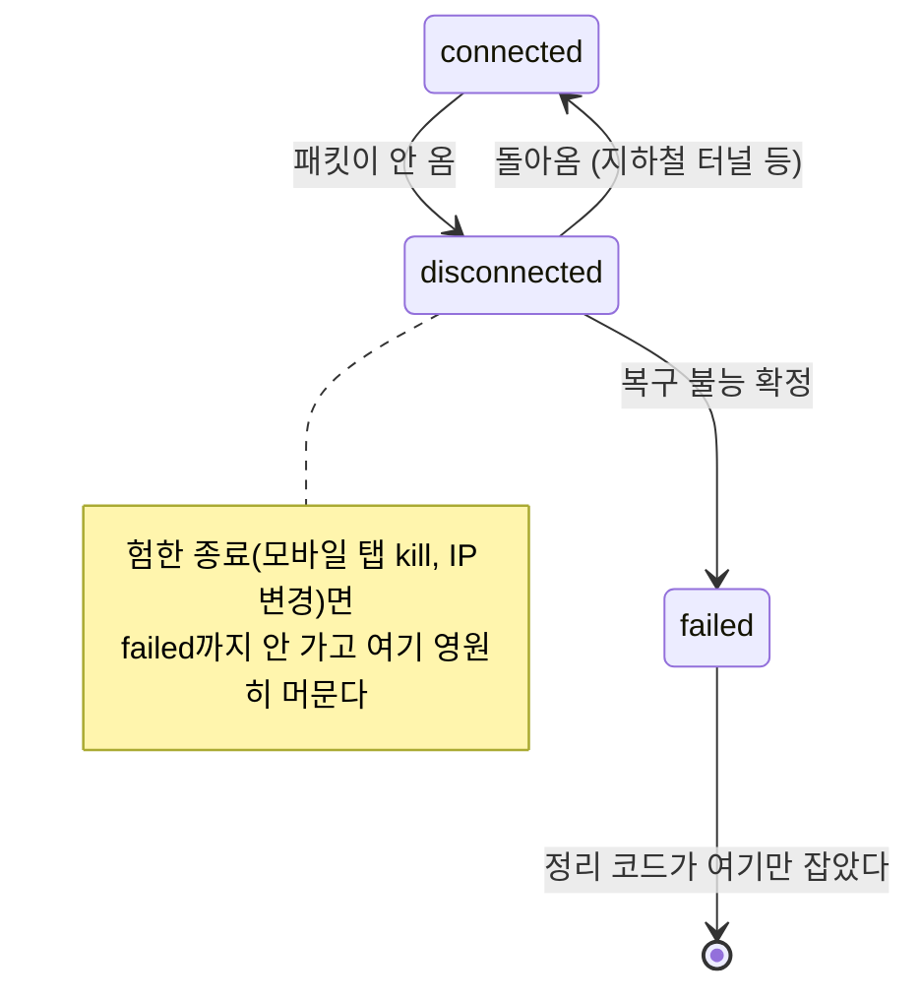

# 운영에서만 터지는 문제들

> [!summary] 한 줄 요약
> v4의 운영 부담 3가지(로그 폭탄·좀비 세션·event loop 불일치)와 유실된 버그 수정 2건. 공통점은 전부 **"dev에선 안 보이다가 운영에서만 터진다"**는 것 — 트래픽 양, 실사용자 행동, 프로세스 구조는 개발 환경이 재현하지 못한다.

## ① 로그 폭탄

`v4/audio_tracks.py`에 `logger.warning`이 12곳 있었는데 **그중 7곳이 정상 경로**였다 — 발화 통과, 음성 상태(2초마다), 발화 종료, 짧은 발화 차단, 끼어들기 감지… 전부 "정상 동작"인데 warning으로 찍혔다. 한 사람이 10분만 통화해도 수백 줄.

warning은 "사람이 봐야 하는 것"이라는 뜻이라서:

| 문제 | 결과 |
|---|---|
| 디스크 | 로그 파일이 순식간에 커짐 |
| **경보 피로** | 진짜 문제가 수천 줄 정상 로그에 묻힘 |
| 성능 | 오디오 핫패스(20ms마다 프레임)에서 문자열 포맷팅 + 디스크 I/O |

원 개발자도 알고 있었다 — 주석에 "로그 폭탄 방지"라고 써놓고 **빈도만 4배 줄이고 레벨은 warning 그대로** 뒀다. 근본 해결이 아니라서 후속 핫픽스 3건이 이 문제만 쫓아다녔다.

**수정**: 레벨을 성격에 맞게 재분류 — 정상 흐름은 `debug`, 진짜 이상(프리버퍼 타임아웃, 좀비 판단, 언더플로 등)만 `warning` 유지, 드문 안전장치(강제 플러시)는 `info`. 이 재분류의 누락분 6곳은 Codex 리뷰가 잡아냈다 — 계획서가 1곳만 지목했었다.

## ② 좀비 세션

**모바일에서 앱을 닫거나 WiFi→LTE로 전환하면 세션이 영원히 안 죽는다.**

### 왜 — ICE 상태의 함정

- **데스크톱**: 탭을 닫아도 브라우저가 살아 있어 "나 간다" 신호를 보낼 기회가 있다 — 고운 종료.
- **모바일**: 반응형 웹이라 형태는 웹이지만, 그걸 담은 브라우저 앱의 생사를 **폰 OS가 쥔다.** 앱 전환 → 탭 동결(JS 정지), 메모리 부족 → 통보 없이 kill, WiFi→LTE → IP 자체가 바뀜. 셋 다 작별 인사 없이 사라진다 — 험한 종료.

서버는 "패킷이 안 오네?"만 보이고, 일시적 끊김과 구분이 안 되니 ICE는 신중하게 `disconnected`에 머물며 기다린다. 그런데 정리 코드가 `failed/closed`만 잡았으니, **영원히 안 돌아오는 disconnected가 영원히 살아남았다.** PeerConnection·OpenAI 연결·LangGraph 세션이 자원을 쥔 채 누적 → 서버가 말라죽는다.

dev에서 안 보인 이유(원 커밋 그대로): dev는 테스트 트래픽만이라 좀비가 거의 안 생겼고, 운영은 실사용자 다수로 누적됐다.

**수정 (PR #590 복원)** — 3중 방어선: ① disconnected 유예 타이머 30초 ② 60초 주기 스위퍼(고아 runtime 세션도 정리) ③ 오디오 언더플로 약 60초 감지. 이 수정은 롤백 때 어중간하게 잘려 **호출자 없는 고아 함수**(`active_session_ids`)만 dev에 남아 있었다. 원본 수정 자체에도 회귀가 있었다 — 언더플로 카운터를 성공 수신 시 리셋하지 않아 정상 세션을 조기 종료시켰고 16분 뒤 재수정됐다. 복원 계획에 이 점을 명시해뒀다.

## ③ event loop 불일치

**dev에서는 완벽한데 운영에서만 답변이 안 나온다. 에러도 없이 그냥 조용하다.**

원인은 [[gunicorn 멀티워커 구조]]의 함정 ①②의 합작이다: `ServerWebRTCSessionManager`가 모듈 바닥에서 생성되며 import 시점에 `asyncio.get_event_loop()`로 **마스터의 idle 루프를 캡처**했고, `self._loop.create_task(...)`가 그 **아무도 안 돌리는 루프**에 태스크를 예약했다 ([[이벤트 루프]]의 우편함). RAG tool 호출이 예약만 되고 영원히 실행 안 되니 OpenAI는 결과를 기다리며 침묵.

**수정**: 예약 시점에 `asyncio.get_running_loop()`를 우선 시도하는 `_get_loop(fallback)` 헬퍼 — "import 시점이 아니라 **요청 처리 시점**에 루프를 찾는다."

이 버그의 교활함: 원 개발자가 `server_webrtc.py`를 고쳤는데(#579) 5시간 뒤 같은 증상이 또 났다 — `tool_call_orchestrator.py`에 같은 뿌리의 문제가 있었는데 그 파일을 놓쳤다. **같은 패턴이 여러 파일에 흩어져 있으면 하나만 고쳐선 안 된다.** 이번 복원은 호출부 16곳을 전수 교체하고, 누가 `self._loop.create_task`를 새로 추가하면 실패하는 **가드 테스트**를 넣었다(이것도 Codex 요구 — 헬퍼만 테스트하면 호출부를 되돌려도 통과하는 무용지물이었다).

## ④ 번외 — 유실된 버그 수정 2건 (Task 2)

v4 개발 중 고쳤지만 롤백에 휩쓸려 사라진, **v4와 무관하게 그 자체로 옳은** 수정들.

**수정 A — chat_id UUID→정수 변환**: RAG 테이블명이 `td_{chat_id}_training_data`인데 프론트가 UUID를 보내면 하이픈 때문에 SQL 구문 오류. DB에서 정수로 변환 후 사용.

**수정 B — GA 모델 형식 대응**: `gpt-realtime-2`(GA)는 `response.create`에 `modalities/voice/output_audio_format`을 넣으면 거부한다. 모델 계열 분기 추가.

복원 리뷰에서 원본 수정의 결함이 드러났다:

- **Critical 1**: 변환 실패(조회 없음 또는 DB 오류) 시 UUID가 그대로 테이블명에 들어가 **막으려던 SQL 오류가 그대로 재발**하는 구조였다 → 실패 시 검색을 중단하고 모델에 깔끔한 오류 메시지 반환으로 수정.
- **Critical 2**: `"-" in chat_id`로만 판별해 하이픈 없는 이상값이 검증 없이 SQL 식별자로 들어갔다 → 최종 식별자 안전성 검증 관문 추가.
- **Important**: `asyncio.wait_for`가 벡터 검색만 감싸고 그 뒤의 LLM 요약 호출은 타임아웃 밖 — OpenAI 지연 시 음성 세션이 무한 대기할 수 있는 구조("버튼 눌러도 반응 없음"과 같은 증상 가능) → 남은 타임아웃 예산 안으로 이동, 초과 시 요약 생략.
- **테스트 무용지물**: `hasattr` 심볼 존재만 확인하던 테스트 5건이 Critical 버그를 안고도 전부 통과했다 → 실제 동작 검증 테스트로 교체, 재리뷰어가 pre-fix 코드로 되돌려 3건이 정확히 실패함을 확인.

## 한 장으로 정리

| | 증상 | 근본 원인 | 왜 dev에서 안 보였나 |
|---|---|---|---|
| 로그 폭탄 | 로그 폭증, 경보 묻힘 | 정상 경로에 warning 7곳 | 트래픽이 적어 양이 안 쌓임 |
| 좀비 세션 | 세션이 안 죽고 자원 누적 | disconnected를 정리 대상에서 누락 | 실사용자가 없어 좀비가 안 생김 |
| event loop | 운영에서만 답변 미출력 | import 시점 루프 캡처 | dev는 단일 워커라 루프가 같음 |
| chat_id | RAG 검색 SQL 오류 | UUID를 테이블명에 직접 보간 | — (v2/v4 경로 전용) |
| GA 모델 | 응답 생성 거부 | OpenAI 형식 변경 미반영 | — |

전임자가 2일간 핫픽스 8개를 쏟고도 못 잡은 이유가 여기 있다 — **고칠 때마다 dev에서는 잘 되니까 배포했고, 운영에서 또 다른 게 터졌다.** 이번 복원은 이 셋을 모두 사전에 제거하고 들어간다 → [[v4 복원 작업 현황]]

## 관련 노트

- ICE disconnected의 의미 → [[WebRTC 연결 과정]]
- 죽은 루프의 원리 → [[이벤트 루프]], [[gunicorn 멀티워커 구조]]
- 이 문제들이 생긴 배경 구조 → [[v3와 v4 아키텍처]]
