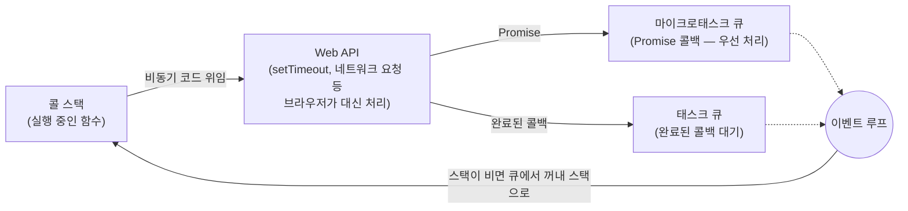

# 이벤트 루프

> [!summary] 한 줄 요약
> 이벤트 루프는 **하나의 스레드 안에서 무한히 돌아가는 while문**이다. 큐에서 작업을 꺼내 **자기가 직접 실행**한다 — 다른 워커에게 나눠주는 분배자가 아니다. 그리고 루프는 **누군가 돌려야만 도는** 코드다. 아무도 안 돌리는 루프에 예약된 작업은 영원히 실행되지 않는다.

## JS 이벤트 루프 — 구성 요소

자바스크립트는 싱글 스레드 언어다. 그런데도 비동기 작업이 되는 건 브라우저(외부 환경)와 협력하기 때문이다.



동작 순서:

1. **동기 실행** — 코드가 콜 스택에 쌓이고 순서대로 실행
2. **비동기 위임** — `setTimeout` 등을 만나면 Web API로 보냄
3. **큐 이동** — 완료된 작업의 콜백이 태스크 큐로
4. **루프** — 이벤트 루프는 콜 스택이 **완전히 비었는지** 확인하고, 비었으면 큐의 함수를 스택으로 넘겨 실행. 마이크로태스크(Promise)가 매크로태스크보다 먼저다

## 헷갈렸던 것 — 이벤트 루프는 분배자가 아니다

처음엔 "큐가 들어오면 워커에게 지정해 처리하게 하는 것"이 이벤트 루프인 줄 알았다. **아니다.** 그 구조는 **스레드 풀(생산자-소비자 패턴)**이라는 다른 것이다.

| 구분 | 이벤트 루프 | 스레드 풀 (분배형) |
|---|---|---|
| 일꾼 수 | 메인 1명 (싱글 스레드) | 여러 워커 스레드 |
| 큐를 대하는 자세 | 꺼내서 **자기가 직접 실행** | 꺼내서 **노는 워커에게 배정** |
| 분배자 | **없음** | 디스패처/매니저 존재 |

- 이벤트 루프는 스레드 그 자체도 아니다 — **하나의 스레드가 실행하는 무한 반복 코드**다. "하나의 스레드에서 하나의 루프가 돈다"고 표현할 수는 있다.
- Node.js도 파일 IO 같은 무거운 작업은 내부적으로 libuv의 스레드 풀을 쓴다. 그때 분배는 libuv의 관리자가 한다 — 이벤트 루프가 아니라.

스레드가 뭔지는 [[프로세스와 스레드]] 참조.

## Python asyncio — 같은 개념, 다른 구현

우리 서버(FastAPI + aiortc)의 이벤트 루프는 **Python asyncio**다. JS 이벤트 루프와 같은 개념 — 싱글 스레드가 큐에서 작업을 꺼내 직접 실행하는 무한 루프 — 을 파이썬 런타임에 구현한 것이다.

JS와 결정적으로 다른 점 하나: **JS는 루프가 런타임에 자동으로 내장돼 돌지만, 파이썬은 루프 객체를 만들고 누군가 명시적으로 돌려야 한다** (`run_until_complete`, uvicorn 워커의 실행 등).

```python
loop = asyncio.get_event_loop()   # 루프 객체를 얻는다 — 아직 안 돈다!
loop.create_task(coro)            # 이 루프의 큐에 예약할 뿐
# 누군가 이 루프를 run 하지 않으면 태스크는 영원히 잠들어 있다
```

## "아무도 안 여는 우편함" — 죽은 루프 문제

여기서 v4의 치명적 버그가 나왔다. 루프 객체는 여러 개 존재할 수 있고, **예약한 루프와 실제로 도는 루프가 다르면**:

- 예약은 성공한다 (에러 없음)
- 그런데 그 루프는 아무도 안 돌린다
- 태스크는 큐에 얹힌 채로 영원히 잠든다

편지를 **아무도 안 여는 우편함**에 넣은 셈이다. 부치긴 했는데 배달이 안 된다. 에러도 안 나서 **그냥 조용하다** — 가장 잡기 어려운 종류의 버그다.

이 일이 실제로 일어난 구조(gunicorn 마스터의 idle 루프 캡처)는 [[gunicorn 멀티워커 구조]]에, 증상과 수정은 [[운영에서만 터지는 문제들]]에 정리했다.

## 관련 노트

- 루프를 담는 그릇, 스레드와 프로세스 → [[프로세스와 스레드]]
- 죽은 루프가 실제로 만들어진 환경 → [[gunicorn 멀티워커 구조]]
- 그 버그의 증상과 수정 → [[운영에서만 터지는 문제들]]
