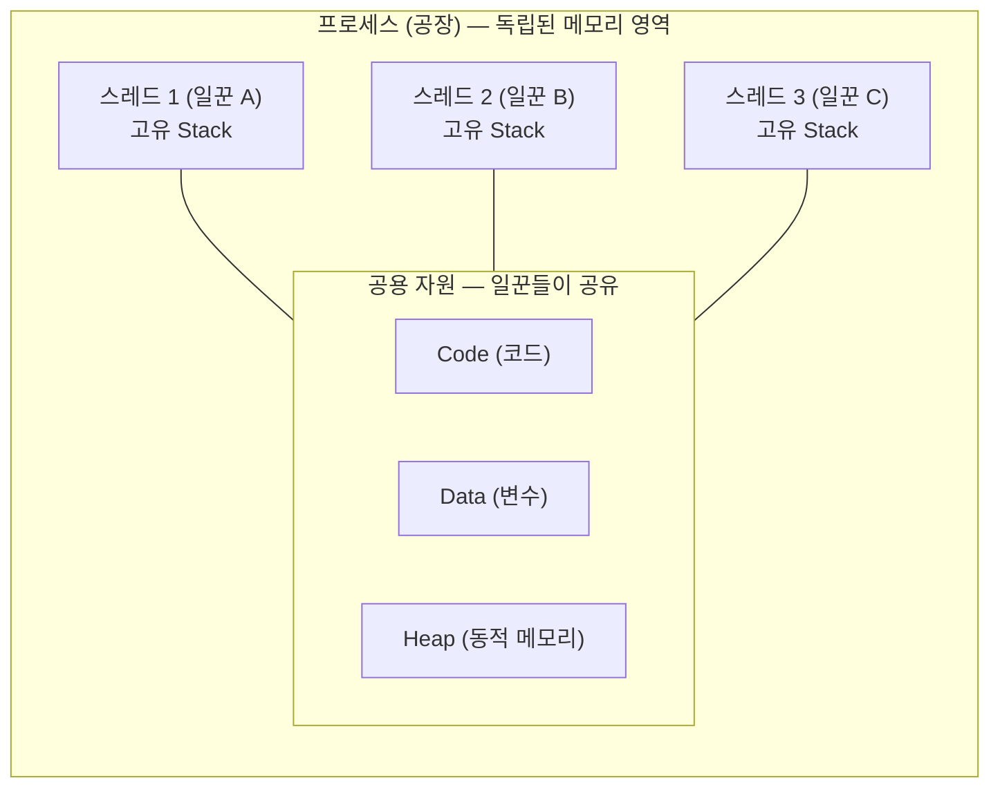

# 프로세스와 스레드

> [!summary] 한 줄 요약
> **프로세스는 공장, 스레드는 그 안의 일꾼**이다. 공장(프로세스)마다 일꾼(스레드)이 최소 1명은 있어야 돌아가고, 여러 명을 둘 수도 있다(멀티스레드). 같은 공장의 일꾼끼리는 작업대(메모리)를 공유하지만, **다른 공장과는 철저히 단절**된다.

## 기본 관계

- **프로세스(Process)**: 운영체제로부터 메모리와 자원을 할당받아 실행 중인 프로그램의 인스턴스. 공장 건물.
- **스레드(Thread)**: 프로세스 내부에서 실제로 코드를 실행하는 실행 흐름의 단위. 일꾼.

## 핵심 규칙 3가지

1. **모든 프로세스에는 최소 1개의 스레드가 있다.** 공장이 지어지면 일할 사람이 최소 한 명은 있어야 한다 — 이것이 **메인 스레드**. 자바스크립트가 이 메인 스레드 하나로만 일하는 싱글 스레드 언어다 ([[이벤트 루프]]).
2. **하나의 프로세스에 여러 스레드를 둘 수 있다(멀티스레드).** 브라우저 한 프로세스 안에서 일꾼 A는 화면을 그리고, B는 음악을 재생하고, C는 다운로드하는 식.
3. **메모리 공유가 가장 중요한 차이.** 같은 프로세스의 스레드들은 Code/Data/Heap을 공유한다 — 협력이 빠르고 쉽다. 반면 **독립된 프로세스끼리는 메모리가 철저히 분리**되어 서로의 메모리에 접근할 수 없다.

3번의 대가도 있다: 자원을 공유하니 한 일꾼이 사고 치면 공장 전체가 멈출 수 있고, 자원 충돌(경쟁 상태·데드락)이 생긴다. JS가 위험한 멀티스레드 대신 싱글 스레드 + 이벤트 루프를 택한 배경이다.

## "워커"라는 말의 함정 — 문맥마다 다른 것을 가리킨다

학습하면서 가장 헷갈렸던 지점. 같은 단어가 세 가지 다른 층위에서 쓰인다:

| "워커"가 나온 문맥 | 실체 | 층위 |
|---|---|---|
| **gunicorn 워커 4개** | 독립된 **프로세스** (fork된 공장 4채) | 소프트웨어 |
| **스레드 풀의 워커** | 프로세스 안의 **스레드** (일꾼) | 소프트웨어 |
| **CPU의 코어를 워커로 비유** | 물리적 연산 장치 (하드웨어 일꾼) | **하드웨어** |

- "코어 = 물리적 워커"는 하드웨어 비유로는 맞다. 하지만 **gunicorn 워커는 코어가 아니라 프로세스**다 — 코어 4개짜리 CPU에서 gunicorn 워커를 8개 띄울 수도 있다(OS가 시간을 쪼개 돌린다 → [[CPU 코어와 컨텍스트 스위칭]]).
- 우리 서버의 "워커 4개"는 gunicorn이 fork한 **프로세스 4개**다. 프로세스라서 **메모리를 공유하지 않고**, 그래서 워커2가 만든 세션을 워커4가 모른다 → [[gunicorn 멀티워커 구조]]

## 프로세스는 몇 개까지 만들 수 있나

코어 수와 무관하게 얼마든지 — 작업 관리자를 보면 프로세스 수백 개, 스레드 수천 개가 떠 있다. 제한을 거는 것은 코어 수가 아니라 **메모리(RAM) 용량**이다(스레드마다 Stack 등 관리 공간이 필요하니까). 코어 수는 "동시에 **진짜로** 실행되는 수"만 정한다 → [[CPU 코어와 컨텍스트 스위칭]]

## 관련 노트

- 일꾼(스레드) 하나가 돌리는 무한 반복 코드 → [[이벤트 루프]]
- 하드웨어 쪽 일꾼, 코어 → [[CPU 코어와 컨텍스트 스위칭]]
- 프로세스 여러 개가 협력(?)하는 실전 구조 → [[gunicorn 멀티워커 구조]]
