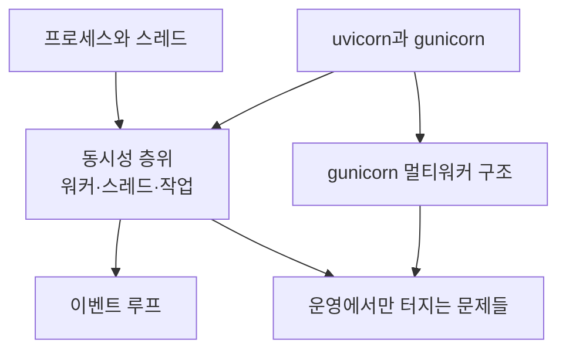

# 00 학습 지도 — 파이썬 웹 서버 실행 구조

우리 앱이 **어떻게 실행되고 요청을 받는지**에 대한 지도. 2026-08-13 정리.

[[00 학습 지도 (MOC)|음성채팅과 네트워크]] 쪽 노트들이 "무엇이 잘못됐나"를 다룬다면, 이 폴더는 **"그게 왜 그 구조에서 터지나"**를 다룬다.

## 왜 따로 정리했나

v4 의 ICE 5초 문제를 추적하면서 **"gunicorn 워커 4개가 고갈된다"** 고 이해했는데, 2026-08-13 서버 실측에서 그 전제가 통째로 틀렸다는 게 드러났다. dev 는 gunicorn 을 쓰지도 않았고 워커 4개라는 숫자도 근거가 없었다.

원인 설명이 틀리면 다음 판단도 틀린다. 그래서 실행 구조를 처음부터 다시 정리했다.

## 노트 관계도

## 읽는 순서

1. [[uvicorn과 gunicorn]] — 각각 뭐고 왜 둘 다 필요한가. FastAPI 는 서버가 아니다
2. [[동시성 층위 — 워커·스레드·작업]] — 워커는 프로세스, 요리사는 스레드, 냄비는 작업
3. [[gunicorn 멀티워커 구조]] — 멀티워커에서만 생기는 함정 3가지 (기존 노트)

기초가 필요하면 [[프로세스와 스레드]] → [[CPU 코어와 컨텍스트 스위칭]] → [[이벤트 루프]] 순으로 먼저 본다.

## 우리 프로젝트의 실제 구성 (2026-08-13 실측)

| 구분 | 실행 방식 |
|---|---|
| dev Chat App (9010) | `uvicorn app:app` **단독** — 프로세스 1개, 루프 1개 |
| 이 서버의 다른 gunicorn | `--workers 2` (명령줄 지정) |
| 운영 Chat App | gunicorn + UvicornWorker, 워커 수 **미확인** |

`config.example.py` 의 `APP_WORKERS = 4` 는 구동에 쓰이지 않는 기본값이다. `gunicorn.conf.py` 의 `worker`(단수) 오타 때문에 전달되지도 않는다.

## 전체를 관통하는 문장

> **워커 수는 동시 처리 인원이 아니다.** 요리사 한 명이 냄비 수백 개를 돌린다.
> 다만 **한 냄비가 요리사 손을 붙잡으면 그 프로세스가 통째로 멈춘다** —
> ICE 5초가 정확히 그것이었고, dev 는 요리사가 한 명뿐이라 즉사했다.
